[TOC]

# JavaSE

# Java 基础

## JDK 和 JRE

+ **JDK 是什么？有哪些内容组成？**

  JDK 是 Java 开发工具包

  + **JVM 虚拟机:** Java 程序运行的地方

  + **核心类库:** Java 已经写好的东西，可以直接用

  + **开发工具:**  Javac、Java、jdb、jhat...

+ **JRE 是什么？有哪些内容组成？**

  + JRE 是 Java 运行环境
  + JVM、核心类库、运行工具

+ **JDK，JRE，JVM三者的包含关系**

  + JDK 包含 JRE

  + JRE 包含 JVM

## 运算符

### 算术运算符

+ **隐式转换（自动类型提升）**

  + 把一个==取值范围小==的数值，转成==取值范围大==的数据

  + **取值范围:** double > float > long > int > short > byte

  + 取值范围小的，和取值范围大的进行运算，小的会先提升为大的，再进行运算

  + byte short char 三种类型的数据在运算时，都会直接先提升为 int ，然后再进行运算

    ```java
    byte a = 10;
    byte b = 20;
    数据类型? c = a + b; // a 和 b 为 byte, 在运算时提升为 int, 故此时数据类型为 int.
    ```

+ **强制转换**

  + 把一个==取值范围大==的数值，转成==取值范围小==的数据

  + `目标数据类型 变量名 = (目标数据类型) 被强转的数据;`
  
+ **字符串的 "+" 操作**

  + 当 "+" 操作中出现字符串时, 这个 "+" 是字符串连接符, 而不是算术运算符了, 会将前后的数据进行拼接, 并产生一个新的字符串

  + 连续进行 "+" 操作时, 从左到右逐个执行

  + `System.out.println(1 + 2 + "abc" + 2 + 1); // "3abc21"`

### 自增自减运算符

+ **参与计算:** 后缀(a++ 先用后加), 前缀(++a 先加后用)

### 逻辑运算符

+ **普通逻辑运算符:** &, |, ^, !
+ **短路逻辑运算符:** &&, ||

### 原码反码补码

+ **原码**
  + 十进制数据的二进制表现形式, 最左边是符号位, 0为正, 1为负
  + **弊端**: 利用原码进行计算时, 如果是正数没有问题, 但如果是负数计算, 结果会出错, 实际运算方向跟正确的运算方向==相反==
+ **反码**
  + 为了解决原码不能计算负数的问题而出现的
  + 正数的反码不变, 负数的反码在原码的基础上, 符号位不变, 数值取反, 0变1, 1变0
  + **弊端**: 负数运算时, 如果结果不跨0, 没有问题, 但如果结果跨0, 跟实际结果会有1的偏差
+ **补码**
  + 为了解决负数计算时跨0的问题而出现的
  + 正数补码不变, 负数的补码在反码的基础上 +1, 另外补码还能多记录一个特殊的值 -128, 该数据在1个字节下, 没有原码和反码
  + **计算机的存储和计算都是以补码的形式进行的**

​            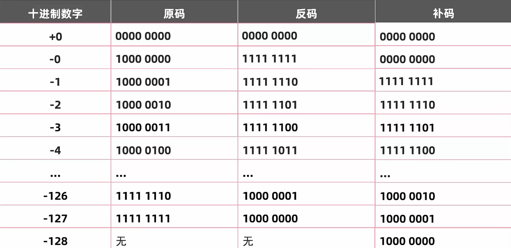

> 该知识可以解释类型转换

### 其他运算符

| 运算符  |      含义      |             运算规则             |
| :-----: | :------------: | :------------------------------: |
|  **&**  |   **逻辑与**   |      **0为false, 1为true**       |
| **\|**  |   **逻辑或**   |      **0为false, 1为true**       |
| **<<**  |    **左移**    |      **向左移动, 低位补0**       |
| **>>**  |    **右移**    | **向右移动, 高位补0或1(看符号)** |
| **>>>** | **无符号右移** |      **向右移动, 高位补1**       |

## 判断和循环

### switch

+ **default**不一定写在最下面, 可写在任意位置, 但仍是最后执行
+ **case穿透:** 首先会拿小括号中表达式的值跟下面每一个case进行匹配, 如果匹配上了, 就会执行对应的语句体, 如果此时发现了break, 那么结束整个switch语句, 如果没发现break, 那么程序会继续执行下一个case的语句体, 一直遇到break或右大括号为止

> JDK12新特性:
>
> ```java
> switch (number) {
>     case 1 -> System.out.println("1");
>     	case 2 -> System.out.println("2");
>     	case 3 -> System.out.println("3");
>     	default -> System.out.println("无");
> }
> ```
>
> 默认case语句体内有break

+ **switch 和 if 的使用场景**
  + **if:** 一般用于对范围的判断
  + **switch:** 把有限个数据一一列举出来选择

### for 与 while 的区别

+ for 循环中, 控制循环的变量, 因为归属 for 循环的语法结构中, 在 for 循环结束后, 就不能再次被访问到了
+ while 循环中, 控制循环的变量, 对于 while 循环来说不归属其语法结构中, 在 while 循环结束后, 该变量还可以继续使用

## 数组

### 初始化

+ **在内存中为数组容器开辟空间, 并将数据存入容器中的过程**

+ **静态初始化**
  + 数据类型[] 数组名 = new 数据类型[] { 元素1, 元素2, 元素3...}
  + **简化后:** 数据类型[] 数组名 = { 元素1, 元素2, 元素3...}
  + **范例:** `int[] array = new int[] {11, 22, 33};`
  + **简化后:** `int[] array = {11, 22, 33};`
+ **动态初始化**
  + 数据类型[] 数组名 = new 数组类型[数组长度]
  + **范例:** `int[] array = new int[3];`
  + **数组默认初始化规律**
    + **整数类型:** 默认为 0
    + **小数类型:** 默认为 0.0
    + **字符类型:** 默认为 '/u0000' (空格)
    + **布尔类型:** 默认为 false
    + **引用数据类型:** 默认为 null

### 地址值

+ 数组地址值表示数组在内存中的位置
+ 以 `[D@776ec8df` 为例
  + [ : 表示当前是一个数组
  + D: 表示当前数组里面的元素都是double类型的
  + @: 表示一个间隔符号 (固定格式)
  + 776ec8df: 数组真正的地址值 (十六进制)

### 遍历数组

+ 在 IDEA 自动生成数组的遍历方式: `数组名.fori`

### 内存图

+ **栈:** 方法运行时使用的内存, 比如 main 方法运行, 进入方法栈中执行
+ **堆:** 存储对象或者数组, new 来创建的, 都存储在堆内存中
+ **方法区:** 存储可以运行的 class 文件
+ **本地方法栈:** JVM 在使用操作系统功能的时候使用, 和我们开发无关
+ **寄存器:** 给 CPU 使用, 和我们开发无关

   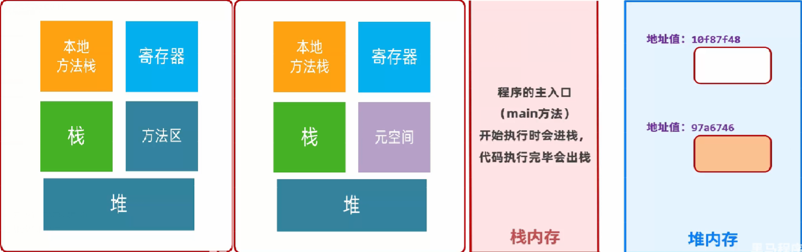

>从JDK8开始, 取消方法区, 新增元空间, 把原来方法区的多种功能进行拆分, 有的功能放到了栈中, 有的功能放到了元空间中

​    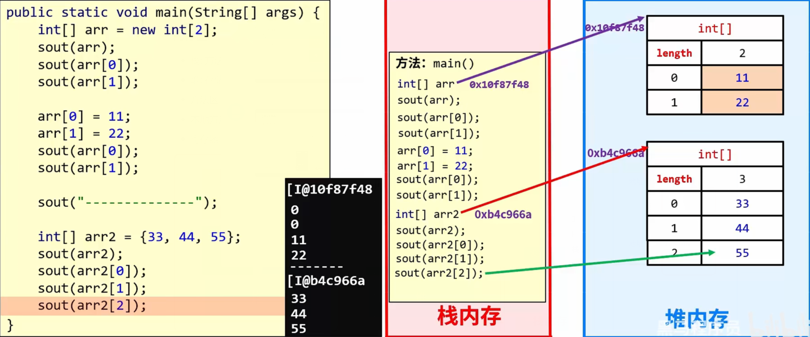

+ 当两个数组指向同一个小空间时, 其中一个数组对小空间中的值发生了改变, 那么其他数组再次访问的时候都是修改之后的结果了

> ==**拓展**:== 思考二维数组内存图 (静态初始化, 动态初始化, 动态初始化的两种特例)

## 方法

> 程序中最小的执行单元

### 形参与实参

+ **形参:** 形式参数, 方法==定义==中的参数
+ **实参:** 实际参数, 方法==调用==中的参数 

### 注意事项

+ 方法之间是平级关系, 不能相互嵌套定义

### 重载

+ 在同一个类中, 定义了多个**同名的方法**, 这些同名的方法具有同种功能

+ 每个方法具有不同的**参数类型**或**参数个数**, 这些同名的方法构成重载关系

+ 同一个类中, 方法名相同, 参数不同的方法. 与返回值无关

  + **参数不同:** 个数不同, 类型不同, 顺序不同

  ```java
  // 不构成重载关系, 因为未满足参数不同这个要求
  public class MethodDemo {
      public static void fn(int a) {
          // 方法体
      }
      public static int fn(int a) {
          // 方法体
      }
  }
  ```

+ 虚拟机通过参数的不同来区分同名的方法

### 方法的内存

+ **基本数据类型:** 整数类型, 浮点数类型, 布尔类型, 字符类型
  + 数据值是存储在自己的空间中
  + 赋值给其他变量, 也是赋值真实的值
+ **引用数据类型:** 需要 new 创造的
  + 数据值是存储在其他空间中, 自己空间中存储的是地址值
  + 赋值给其他变量, 赋值的是地址值

### 方法的值传递

+ **传递基本数据类型的内存原理**

  + 传递基本数据类型时, 传递的是真实的数据, 形参的改变, 不影响实参的值

  + ```java
    public class ArgsDemo01 {
        public static void main(String[] args) {
            int number = 100;
            sout("调用change方法前: " + number);
            change(number);
            sout("调用change方法后: " + number);
        }
        public static void change(int number) {
           	number = 200;
        }
    }
    /*
    	输出结果为: 
    	调用change方法前: 100
    	调用change方法后: 100
    */
    ```

+ **传递引用数据类型的内存原理**

  + 传递引用数据类型时, 传递的是地址值, 形参的改变, 影响实参的值

> 以上内容依据内存图来理解

## 键盘录入

+ **第一套体系**

  + nextInt(): 接收整数

  + nextDouble(): 接收小数

  + next(): 接受字符串

    > 键盘录入的字符串是 new 创建的

  + 遇到空格、制表符、回车就停止接收，这些符号后面的数据就不会接受了

+ **第二套体系**

  + nextLine(): 接受字符串
  + 遇到空格、制表符可以接收，遇到回车才停止


# API

> Application Programming Interface 应用程序编程接口

## 字符串

### String

+ 程序中所有字符串文字， 都为此类的对象

+ 字符串不可变， 它们的值在创建后不能被改变

+ **创建对象的方式**

  + `String name = "xxx"`

  + `String name = new String(String original)`

  + `String name = new String(char[] chs)`

    + **需求:** 修改字符串的内容 

      + 如: abc -- {'a', 'b', 'c'} -- {'Q', 'b', 'c'} -- Qbc

    + ```java
      char[] chs = {'a', 'b', 'c', 'd'};
      String s4 = new String(chs);
      sout(s4); // abcd
      ```

  + `String name = new String(byte[] chs)`

    + **应用场景:** 在网络当中传输的数据都是字节信息, 一般要将字节信息进行转换, 转成字符串, 此时就要用到这个构造

    + ```java
      byte[] bytes = {97, 98, 99, 100};
      String s5 = new String(bytes);
      sout(s5); // abcd
      ```

+ **内存模型**

  + 当使用双引号直接赋值时, 系统会检查该字符串在串池中是否存在,不存在则创建新的, 存在则复用 **(节约内存)**

     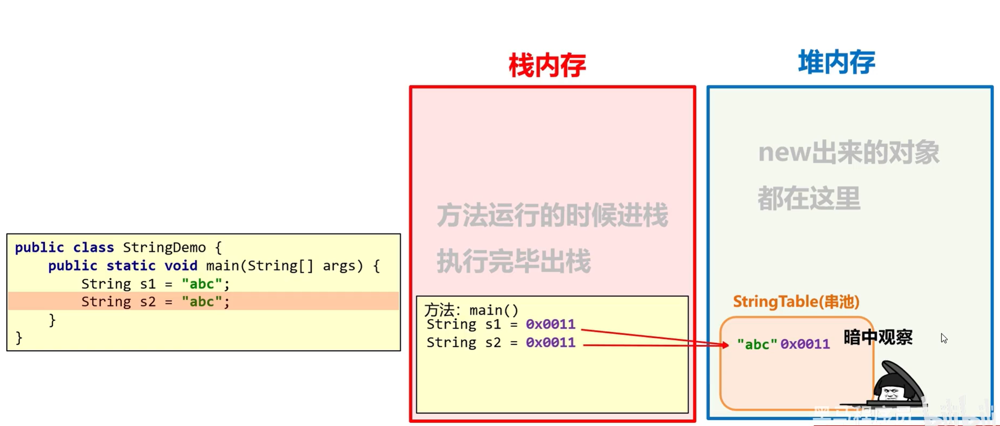

  + 每次 new 都会创造一个新空间, 这种方式创建对象不会复用 **(占内存)**

     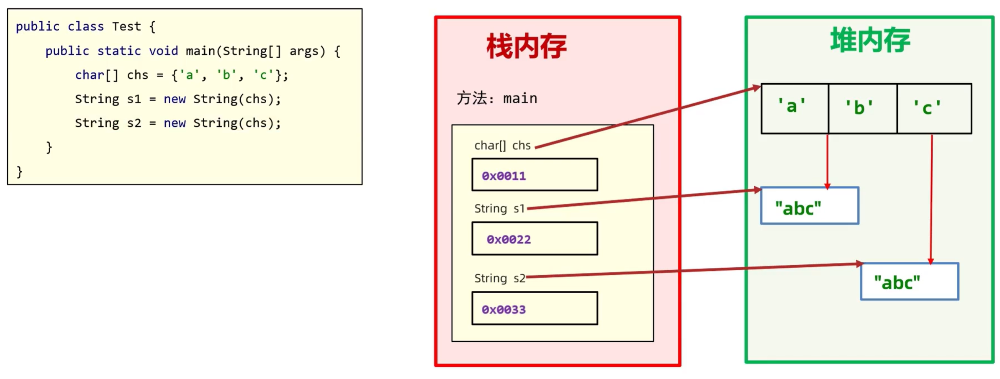

+ **常用方法**

  + **字符串比较**
    + boolean equals()
    + boolean equalsIgnoreCase()
  + int compareTo(String s) : 对字符串进行字典序比较
  + **字符串遍历**
    + char charAt(int index) : 根据索引返回字符
    + int length()
+ **字符串截取**
    + String substring(int beginIndex, int endIndex)
    + String substring(int beginIndex)
  + **字符串替换**
  + String replace(target, replacement)


### StringBuilder

+ StringBuilder 可以看成是一个容器， 创建之后里面的==**内容是可变**==的

+ **作用:** 提高字符串的操作效率 **(拼接和反转字符串时常用StringBuilder)**
+ **构造方法**
  + `StringBuilder strb = new StringBulder()` 
  + `StringBuilder strb = new StringBulder(String str)`
+ **常用方法**
  + StringBuilder append(任意类型) : 添加数据, 并返回对象本身
  + StringBuilder reverse() : 反转容器中的内容
  + int length() : 返回长度
  + String toString() : 将StringBuilder转换成String

### StringJoiner

+ 与 StringBuilder 一样可以看成是一个容器， 创建之后里面的==**内容是可变**==的
+ **作用:** 提高字符串的操作效率, 而且代码编写更加简洁, 但是目前市场上很少有人用(JDK8后出现的)
+ **构造方法**
  + `StringJoiner sj = new StringJoiner(间隔符号)` : 创建一个对象, 指定拼接时的间隔符号
  + `StringJoiner sj = new StringJoiner(间隔符号, 开始符号, 结束符号)` : 创建一个对象, 指定拼接时的间隔符号、开始符号、结束符号
+ **常用方法**
  + StringJoiner add(添加的内容)
  + int length()
  + String toString()

> java已经写好的类, java在底层对它们做了一些处理, 使得打印对象不是地址值而是属性值

### 字符串原理

+ **字符串存储的内存原理**

  + 直接赋值会复用字符串常量池中的
  + new 出来不会复用, 而是开辟一个新空间

+ **`==` 比较的到底是什么**

  + 基本数据类型比较数据值
  + 引用数据类型比较地址值

+ **字符串拼接的底层原理**

  + **无变量直接拼接:** 会复用串池中的字符串

     

  + **有变量拼接**

    + JDK8前: `String s2 = s1 + "b"` 相当于 `new StringBuilder().append(s1).append("b").toString()`

       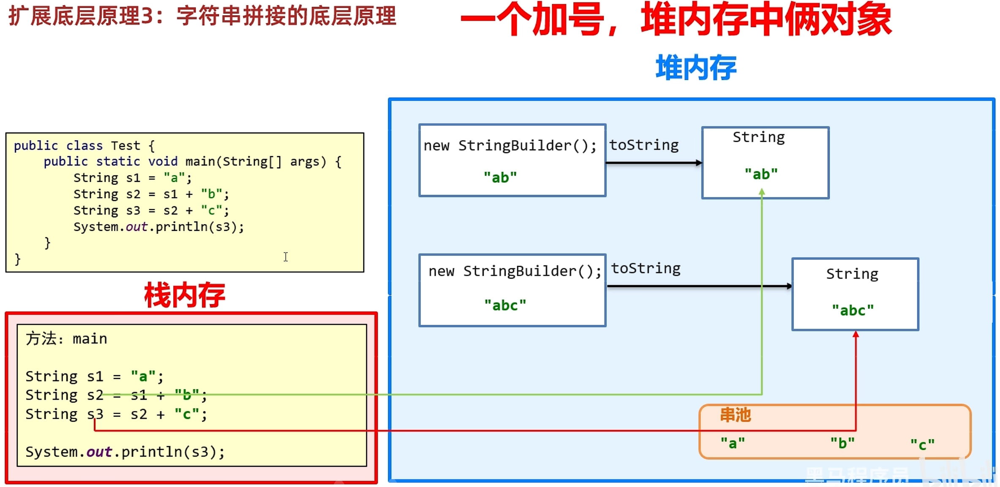

    + JDK8后: 预估空间, 创建数组

       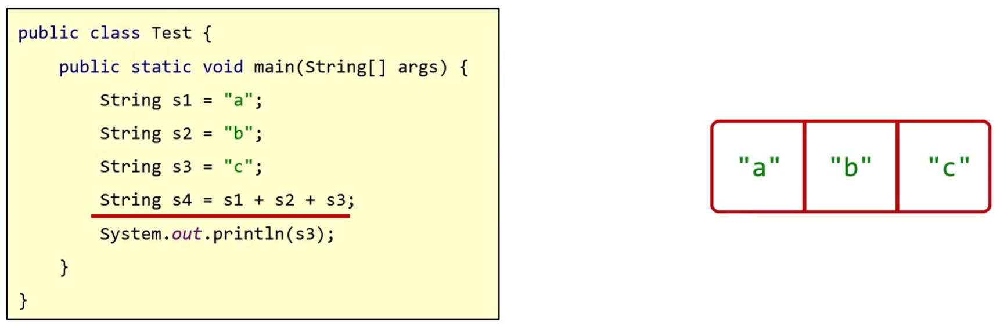

  + **结论:** 如果很多字符串变量拼接, 不要直接 + , 在底层会创建多个对象, 浪费时间, 浪费空间 ==**(建议使用StringBuilder)**==

+ **StringBuilder提高效率原理图**

   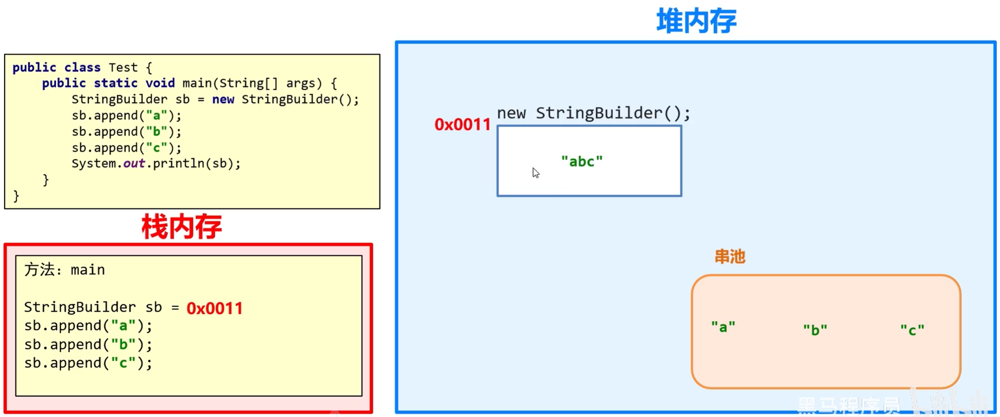

+ **StringBuilder源码分析**

  + 默认创建一个长度为16的字节数组
  + 添加的内容长度小于16, 则直接存
  + 添加的内容长度大于16, 则扩容 (原来容量 * 2 + 2)
  + 如果扩容后还不够, 则以实际长度为准扩容

## ArrayList

+ **集合和数组的对比**

  + **数组**长度固定; **集合**长度可变 (自动扩容)

  + **数组**可以存基本数据类型和引用数据类型; **集合**可以存引用数据类型, 如果要存基本数据类型, 只能存包装类

    + | 基本数据类型 | 对应的包装类 |
      | :----------: | :----------: |
      |     byte     |     Byte     |
      |    short     |    Short     |
      |     char     |  Character   |
      |     int      |   Integer    |
      |     long     |     Long     |
      |    float     |    Float     |
      |    double    |    Double    |
      |   boolean    |   Boolean    |

+ **泛型(\<E\>):** 集合中存储数据的类型

+ **创建集合对象**

  + `ArrayList<数据类型> list = new ArrayList<>()`

+ ArrayList 时 Java 已经写好的一个类, 这个类**在底层做了一些处理**

  + 打印对象不是地址值, 而是集合中存储数据内容
  + 在展示的时候会拿 [ ] 吧所有的数据进行包裹

+ **成员方法**

  + **增**
    + boolean add(E e) : 返回值表示是否添加成功
  + **删**
    + boolean remove(E e) : 返回值表示是否删除成功
    + E remove(int index) : 删除指定索引的元素, **返回被删除的元素**
  + **改**
    + E set(int index, E e) : **返回原来的元素**
  + **查**
    + E get(int index)
    + int size()

## Math

+ **常用方法**
  + int abs(int a)
  + double ceil(double a) : 向上取整
  + double floor(double a) : 向下取整
  + int round(float a) : 四舍五入
  + int max(int a, int b)
  + double pow(double a, double b) : b可以是负数或小数
  + double sqrt(double a)
  + double cbrt(double a)
  + double random() : 返回值为double的随机值, 范围[0.0, 1.0)

## System

+ **常用方法**
  + void exit(int status) : 终止当前java虚拟机(0 : 正常停止；1 : 异常停止)
  + long currentTimeMillis() : 返回当前系统的时间毫秒值形式(时间原点 1970.1.1 8:0:0)
  + void arraycopy(数据源数组, 起始索引, 目的地数组, 起始索引, 拷贝个数) : 数组拷贝
+ **输出语句**
  + System.out.println()
  + **System :** 类名
  + **out :** 静态变量
  + **System.out :** 获取打印的对象
  + **println() :** 方法
  + **参数 :** 表示打印的内容
  + **核心逻辑**
    + 当我们打印一个对象的时候, 底层会调用对象的toString方法, 把对象变成字符串, 然后再打印再控制台上, 打印完毕换行处理


## Runtime

+ **常用方法**
  + Runtime getRuntime() : 获取当前系统的运行环境对象
  + void exit(int status) : 停止虚拟机
  + int availableProcessors() : 获得CPU的线程数
  + long maxMemory() : JVM能从系统中获取总内存大小(单位byte)
  + long totalMemory() : JVM已经从系统中获取总内存大小(单位byte)
  + long freeMemory() : JVM剩余内存大小(单位byte)
  + Process exec(String command) : 运行cmd命令

## Object

+ **顶级父类**, 只有空参构造

+ **常用方法**

  + String toString()

    + 默认情况下, 因为Object类中的toString方法返回的是地址值, 所以, 默认情况下, 打印一个对象打印的就是地址值, 但是地址值对于我们是没有意义的
    + **处理方案:** 重写父类Object中的toString方法

  + boolean equals(Object obj)

    + 同上, 默认的Object方法比较的是地址值, 需要重写

    + ```java
      String s = "abc";
      StringBuilder sb = new StringBuilder("abc");
      sout(s.equals(sb));  // false
      // equals方法是被s调用的, 而s是字符串
      // 所以equals要看String类中的
      // 字符串中的equals方法, 先判断参数是否为字符串
      // 如果是字符串, 再比较内部的属性
      // 但如果参数不是字符串的, 直接返回false
      
      sout(sb.equals(s));  // false
      // 由于StringBuildedr中没有重写equals方法
      // 使用的是Object中的, 即比较地址值
      ```

  + protected Object clone(int a)

    + 方法在底层会帮我们创建一个对象, 并把原对象中的数据拷贝过去
    + **书写细节**
      + 重写Object中的clone方法
      + 让JavaBean类实现Cloneable接口
      + 创建原对象并调用clone
    + **浅克隆** (Object默认浅克隆)
      + 不管对象内部的属性是基本数据类型还是引用数据类型, 都完全拷贝过来
    + **深克隆** (自己重写或使用第三方工具)
      + 基本数据类型拷贝过来, 常量池中的字符串复用, 引用数据类型会重新创建新的

## Objects

+ **工具类**
+ **常用方法**
  + boolean equals(Object a, Object b) : 先做非空判断, 再比较两个对象
    + 方法底层先判断a是否为null, 如果是null, 直接返回false, 如果不是, 那么就利用a再次调用equals方法
  + boolean isNull(Object obj)
  + boolean nonNull(Object obj)

## BigInteger

+ 在底层占用字节个数: byte1个字节, short2个字节, int4个字节, float4个字节, double8个字节, long8个字节

+ **构造方法**

  + BigInteger(int num, Random rnd) : 获取随机大整数, 范围: [0, 2^num^ - 1]
  + BigInteger(String val) : 获取指定的大整数
  + BigInteger(String val, int radix) : 获取指定进制的大整数

  + public static BigInteger valueOf(long val) : 静态方法获取BigInteger的对象, 内部有优化

+ **总结**

  + 如果BigInteger表示的数字没有超出long的范围, 可以用静态方法获取

  + 如果BigInteger表示的超出long的范围, 可以用构造方法获取

  + 对象一旦创建, BigInteger内部记录的值不能发生改变

    + ```java
      BigInteger bd1 = BigInteger.valueOf(10);
      BigInteger bd2 = BigInteger.valueOf(5);
      BigInteger bd3 = BigInteger.valueOf(10);
      
      sout(bd1 == bd2);  // false
      sout(bd1 == bd3);  // true
      ```

  + 只要进行计算都会产生一个新的BigInteger对象

+ **常见方法**

  + BigInteger add(BigInteger val) : 加法
  + BigInteger subtract(BigInteger val) : 减法
  + BigInteger multiply(BigInteger val) : 乘法
  + BigInteger divide(BigInteger val) : 除法, 获取商
  + BigInteger[] divideAndRemainder(BigInteger val) : 除法, 获取商和余数
  + boolean equals(Object x)
  + BigInteger pow(int exponent)
  + BigInteger max/min(BigInteger val)
  + int intValue(BigInteger val) : 转为int类型正数, 超出范围数据有误

## BigDecimal

+ 用于小数的精确运算
+ **构造方法**
  + BigDecimal(double val) : 有可能不准确, 不建议使用
  + BigDecimal(String val) : 更加精确
  + public static BigDecimal valueOf(double val)
+ **细节**
  + 如果表示的数字不大, 没有超出double的取值范围, 建议使用静态方法
  + 如果要表示的数字比较大, 超出了double的取值范围, 建议使用构造方法
  + 如果我们传递的是0~10之间的**整数**(如果是小数还是会重新new), 包含0和10, 那么方法会返回已经创建好的对象, 不会重新new
+ **常用方法**
  + BigDecimal add(BigDecimal val)
  + BigDecimal substract(BigDecimal val)
  + BigDecimal multiply(BigDecimal val)
  + BigDecimal divide(BigDecimal val) : 整除
  + BigDecimal divide(BigDecimal val, 精确几位, 舍入模式)
    + **舍入模式**(RoundingMode)
      + UP : 远离零方向舍入
      + DOWN : 向零方向舍入
      + CEILING : 向正无限大方向舍入
      + FLOOR : 向负无限大方向舍入
      + HALF_UP : 四舍五入(0.5向上舍)
      + HALF_DOWN : 四舍五入(0.5向下舍)

## 正则表达式

+ **作用**
  + 校验字符串是否满足规则
  + 在一段文本中查找满足要求的内容

+ **用法**

   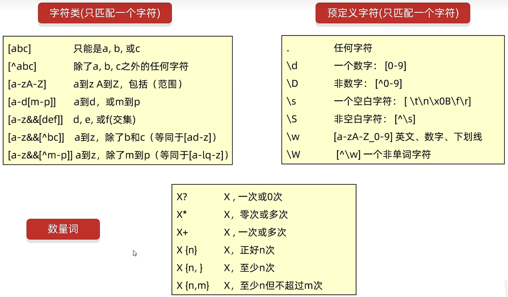

+ **[] :** 只匹配其中的一个

+ **(?i)xxx :** 忽略xxx的大小写

+ **贪婪爬取**

  + ab+ 或 ab*
    + 贪婪(尽可能多): abbbbbbbbbbb...

  + java默认的是贪婪爬取

+ **非贪婪**

  + ab+? 或 ab*?
    + 非贪婪(尽可能少): ab

+ **正则表达式在字符串中的作用**

  + boolean matches(String regex) : 判断字符串是否满足正则表达式的规则
  + String replaceAll(String regex, String newStr) : 按照正则表达式的规则进行替换
  + String[] split(String regex) : 按照正则表达式的规则切割字符串

+ **捕获分组**

  + 每组有组号
    + 以左括号为基准, 最左边的是第一组, 其次是第二组, 以此类推

  + **\\\\组号** : 表示把第x组的内容拿出来再用一次
  + **以 (.)\\\\1* 为例**
    + **(.) :** 以任意单字符看作第一组
    + **\\\\1 :** 把第一组拿出来再次使用
    + **\* :** 作用于 **\\\\1**, 表示把第一组拿出来用0次或多次

  + 后续还要继续使用本组数据
    + 正则内部使用 : \\\\组号
    + 正则外部使用 : $组号
    + 例 : `String s = str.relpaceAll("(.)\\1*", "$1");`

+ **非捕获分组**

  + 仅仅是把数据括起来, 不占用组号
  + **xxx(?=yyy)** : ? 指代前面的数据xxx, = 表示xxx后面要跟随的数据, 获取时只获取xxx
  + **xxx(?:yyy)** : ? 指代前面的数据xxx, : 表示xxx后面要跟随的数据, 获取时获取所有
  + **xxx(?!yyy)** : ? 指代前面的数据xxx, ! 表示xxx后面要跟随的数据, 获取时只获取不包含yyy的xxx文本


### 爬虫

+ **Pattern :** 表示正则表达式对象

+ **Matcher :** 文本匹配器, 按照正则表达式的规则去读取字符串, 从头开始读取

  ```java
  // 获取正则表达式对象
  Pattern p = Pattern.compile(regex);
  // 获取文本匹配器对象
  // m在str中找符合p规则的小串
  Matcher m = p.matcher(str);
  // 寻找匹配器中满足规则的子串
  // 如果没有返回false, 如果有返回true, 在底层记录子串的 起始索引 和 结束索引+1
  while(m.find()) {
  	// 方法底层会根据find方法记录的索引进行字符串的截取
  	String s = m.group();
      sout(s);
  }
  ```

## JDK7以前的时间相关类

### Date

+ Javabean类, 用来描述时间, 精确到毫秒
+ **构造方法**
  + Date date = new Date() : 创建当前时间对象
  + Date date = new Date(毫秒值) : 创建指定时间对象
+ **常用方法**
  + void setTime(long time) : 设置/修改毫秒值
  + long getTime() : 获取时间对象的毫秒值

### SimpleDateFormat

+ **作用**

  + **格式化:** 把时间变成我们喜欢的格式

  + **解析:** 把字符串表示的时间变成Data对象

+ **构造方法**
  + SimpleDateFormat() : 使用默认格式
  + SimpleDateFormat(String pattern) : 使用指定格式
+ **常用方法**
  + final String format(Date date) : 格式化 (日期对象 -- 字符串)
  + Date parse(String source) : 解析 (字符串 -- 日期对象) 

### Calendar

+ Calendar代表了系统当前时间的日历对象, 可以单独修改、获取时间中的年、月、日
+ **细节**
  + Calendar是一个抽象类, 不能直接创建对象
  + **月份范围:** 0~11
  + **星期范围:** 1~7 (但是1代表星期日)
  + **字段表示 (Calendar类中有常量表示)**
    + 0 -- 纪元	1 -- 年	2 -- 月	3 -- 一年中的第几周	4 -- 一个月中的第几周	5 -- 一个月中的第几天(日期) 
+ **获取Calendar日历类对象的方法**
  + public static Calendar getInstance() : 获取当前时间的日历对象
+ **常用方法**
  + final Date getTime() : 获取日期对象
  + final setTime(Date date) : 给日历设置日期对象
  + long getTimeInMillis() : 得到时间毫秒值
  + void setTimeInMillis(long millis) : 给日历设置时间毫秒值
  + int get(int field) : 取日历中的某个字段信息
  + void set(int field, int value) : 修改日历的某个字段信息
  + void add(int field, int amount) : 为某个字段增加/减少指定的值

## JDK8新增的时间相关类

+ 代码更简单, 数据更安全==**(对象不可变)**==
+ **月份范围:** 1~12

### Date相关

#### ZoneId

+ **时区**	
  + 洲名/城市名	国家名/城市名
+ **常用方法**
  + static Set<String\> getAvailableZoneIds() : 获取Java中支持的所有时区
  + static ZoneId systemDefault() : 获取系统默认时区
  + static ZoneId of(String zoneId) : 获取一个指定时区

#### Instant

+ **时间戳**
+ **常用方法**
  + static Instant now() : 获取当前时间的Instant对象 (标准时间)
  + static Instant ofXxxx(long epochMilli) : 根据 (秒/毫秒/纳秒) 获取Instant对象
  + ZonedDateTime atZone(ZoneId zone) : 指定时区
  + boolean isXxx(Instant otherInstant) : 判断系列的方法
  + Instant minusXxx(long millisToSubtract) : 减少时间系列的方法
  + Instant plusXxx(long millisToSubstract) : 增加时间系列的方法

#### ZonedDateTime

+ **带时区的时间**
+ **常用方法**
  + static ZonedDateTime now() : 获取当前时间的ZonedDateTime对象
  + static ZonedDateTime ofXxx(...) : 获取指定时间的ZonedDateTime对象
  + ZonedDateTime withXxx(时间) : 修改时间系列的方法
  + ZonedDateTime minusXxx(时间) : 减少时间系列的方法
  + ZonedDateTime plusXxx(时间) : 增加时间系列的方法


### SimpleDateFormat相关

#### DateTimeFormatter

+ **常用方法**
  + static DateTimeFormatter ofPattern(格式) : 获取格式对象
  + String format(时间对象) : 按照指定方式格式化

### Calendar相关

#### LocalDate

+ 年、月、日

#### LocalTime

+ 时、分、秒

#### LocalDateTime

+ 年、月、日、时、分、秒
+ **常用方法**
  + static XXX now() : 获取当前时间对象
  + static XXX of(...) : 获取指定时间对象
  + get开头方法 : 获取日历中的年、月、日、时、分、秒等信息
  + isBefore, isAfter : 比较两个 LocalDate
  + with开头的 ： 修改时间系列的方法
  + minus开头的 ： 减少时间系列的方法
  + plus开头的 ： 增加时间系列的方法
  + public LocalDate toLocalDate() : LocalDateTime转换成一个LocalDate对象
  + public LocalTime toLocalTime() : LocalDateTime转换成一个LocalTime对象

### 工具类

#### Duration

+ 计算时间间隔 (秒, 纳秒)

#### Period

+ 计算日期间隔 (年、月、日)

#### ChronoUnit

+ 计算日期间隔

## 包装类

+ 基本数据类型对应的引用类型
+ 获取Integer对象的方法
  + public Integer(int value)
  + public Integer(String s)
  + public static Integer valueOf(int i)
  + public static Integer valueOf(String s)
  + public static Integer valueOf(String s, int radix)
  + **区别**
    + 前两种通过 new 创建对象
    + 后三种当创建 -128~127 的数据对象时, 不会创建新的, 而是调用已经创建好的对象
+ JDK5提出的新机制
  + **自动装箱:** 把基本数据类型自动变成其对应的包装类
  + **自动拆箱:** 把包装类自动变成其对应的基本数据类型
  + 在底层自动调用静态方法valueOf得到一个Integer对象
  + 即在JDK5以后, int 和 Integer 可以看作同一个东西
+ **常用方法**
  + static String toBinaryString(int i)
  + static String toOctalString(int i)
  + static String toHexString(int i)
  + static int parseInt(String s) : 将字符串类型的整数转成int类型的整数
    + 8种包装类, 除了Character都有对应的parseXxx方法, 进行类型转换

## Arrays

+ 操作数组的工具类

+ **常用方法**

  + static String toString(数组) : 把数组拼接成一个字符串

  + static int binarySearch(数组, 查找的元素) : 二分查找法查找元素

  + static int[] copyOf(原数组, 新数组长度) : 拷贝数组

  + static int[] copyOfRange(原数组, 起始索引, 结束索引) : 拷贝数组 (指定范围)

  + static void fill(数组, 元素) : 填充数组

  + static void sort(数组) : 按照默认方法进行数组排序

  + static void sort(数组, 排序规则) : 按照指定的规则排序

    + 只能给引用数据类型的数组进行排序, 如果数组是基本数据类型的, 需要变成其对应的包装类

    + ```java
      // 底层原理:
      // 利用插入排序 + 二分查找的方式进行排序
      // 默认把0索引的数据当作是有序的序列, 1索引到最后认为是无序的序列
      // 遍历无序序列得到里面的每一个元素, 假设当前遍历得到的元素是A
      // 把A往有序序列中进行插入, 在插入时, 利用二分查找确定A元素的插入点
      // 拿着A元素, 跟插入到的元素进行比较, 比较的规则就compare方法的方法体
      // 如果返回值是负数, 拿着A继续跟前面的数据进行比较
      // 如果返回值是整数, 拿着A继续跟后面的数据进行比较
      // 如果返回值是0, 也拿着A跟后面的数据进行比较
      
      // 匿名内部类
      Arrays.sort(arr, new Comparator<Integer>() {
          // compare方法的形式参数:
          // 参数一 o1: 表示在无序序列中, 遍历得到的每一个元素
          // 参数二 o2: 有序序列中的元素
          // 返回值: 
          // 负数: 表示当前要插入的元素o1放在前面
          // 正数: 表示当前要插入的元素o1放在后面
          // 0: 表示当前要插入的元素o1跟现在的元素o2是一样的, 也放在后面
          @Override
          public int compare(Integer o1, Integer o2) {
              return 0;
          }
      });
      
      // 简单理解:
      // o1 - o2 : 升序排列
      // o2 - o1 : 降序排列
      ```

## Lambda表达式

+ **函数式编程 (Functional programming)**

  + 是一种思想特点, 忽略面向对象的复杂语法, **强调做什么, 而不是谁去做**

+ **JDK8后出现的新语法形式**

  + **( ) -> { }**
    + **( ) :** 对应着方法的形参
    + **-> :** 固定格式
    + **{ } :** 对应着方法的方法体

+ **注意点**

  + 可以用来简化[匿名内部类](# 内部类)的书写
  + 但只能简化函数式接口的匿名内部类写法
    + **有且仅有一个抽象方法**的接口叫做函数式接口, 接口上方可以加@FunctionalInterface注释

  ```java
  // Lambda完整格式
  Arrays.sort(arr, 
              (Integer o1, Integer o2) -> {
                  return o1 - o2;
              }
  );
  ```

+ **省略规则**

  + 参数类型可以省略
  + 如果只有一个参数, 参数类型和( )都可以省略
  + 如果Lambda表达式的方法体只有一行, 大括号, 分号, return可以省略不写, 需要**同时省略**

  ```java
  // Lambda省略写法
  Arrays.sort(arr, (o1, o2) -> o1 - o2);
  ```


# 面向对象

## 类

+ public class 类名 {

  ​	成员变量(代表属性，一般是名词)

  ​	成员方法(代表行为，一般是动词)

  ​	构造器

  ​	代码块

  ​	内部类
  }

+ **例如**

  ```java
  public class test1.Phone {
      // 属性(成员变量)
      String brand;
      double price;
      
      // 行为(方法)
      public void call() {
          ...
      }
      public void playGame() {
          ...
      }
  }
  ```

## 类的对象

+ 类名 对象名 = new 类名();

+ **例如:** `Phone p = new Phone();`

## 成员变量

+ 修饰符 数据类型 变量名称 = 初始化值

  > 一般无需指定初始化值，存在默认值。

## 封装

> ==对象代表什么，就得封装对应的数据，并提供数据对应的行为==

+ **例如：**
      人画圆: 两个类--人、圆	画行为则属于圆类
      人关门: 两个类--人、门	关门行为则属于门类

+ 我们可以把一些零散的数据封装成一个对象, 以后传递参数的时候, 只要传递一个整体就可以了, 不需要管这些零散的数据

+ **例如:**

  + 可避免以后要新增检查的信息

    + ```java
      User userInfo = new User(username, password, null, null);
      checkUserInfo(userInfo)
      ```

  + 无法避免

    + ```java
      checkUserInfo(username, password);
      ```

## 构造方法

+ public class 类名() {
          修饰符 类名(参数) {
              方法体;
          }
      }

+ **作用:** 给成员变量初始化

+ **特点**
  
     1. 方法名与类名相同，大小写也要一致
     1. 没有返回值类型，连void都没有
     1. 没有具体的返回值 (不能由return带回结果数据)
     
+ **执行实际**
          1. 创建对象的时候由虚拟机调用，不能手动调用构造方法
          2. 每创建一次对象，就会调用一次构造方法

+ **注意事项**

  + **构造方法的定义:** 
    
    1. 如果没有定义构造方法，系统将给出一个默认的无参数构造方法
	  2. 如果定义了构造方法，系统将不再提供默认的构造方法
    
	+ **构造方法的重载:**
  
	  ​	带参构造方法和无参构造方法，两者方法名相同，但是参数不同，这叫做构造方法的重载
  
  + **推荐的使用方式:**
  
	  ​	无论是否使用，都手动书写无参和带全部参数的构造方法
	
	  + **例如：**
	
	  ```java
	  public class Student {
    	private String name;
     		private int age;
      	public Student() {
    			...(空参构造)
    		}
	  		public Student(String name, int age) {
	  		    ...(带参构造)
	  		}
	  }
## 标准的JavaBean类

+ 类名需要见名知意
+ 成员变量使用**private**修饰
+ 提供至少两个构造方法
+ 成员方法
  + 提供每一个成员变量对应的setXXX()/getXXX() ==Alt + Insert 或 右键PTG_to_JavaBean 自动补全==
  + 如果还有其他行为，也需要写上

## 对象内存图

+ **Java内存分配**

  + **栈：**方法运行时所进的内存，变量也是在这里
  + **堆：**new出来的东西会在这块内存中开辟空间并产生地址
  + **方法区：**字节码文件(包含类中所有的成员变量和成员方法的信息)加载时进入的内存

  + **本地方法栈**

  + **寄存器**    

+ **一个对象的内存图：**
         `Student s = new Student()`

     1. 加载class文件 (把Student类的字节码文件加载到内存中)
     2. 申明局部变量 (对s申明)
     3. 在堆内存中开辟一个空间 (new开辟空间)
           1. 默认初始化/显示初始化
           2. 构造方法初始化
     4. 将堆内存中的地址值赋值给左边的局部变量 (即s是一个地址)

+ **两个对象的内存图：**

  ​	`Student s = new Student()`

  ​	`Student s1 = new Student()`

  + 此时不需要再加载Student.class文件，其他步骤一样
  + **注意:** 一个方法执行完毕后要出栈(main也是方法)，方法出栈后指向堆的指针消失，堆中的地址没有变量指向，成为垃圾，也消失

## this

+ **this的作用：**区分局部变量和成员变量
+ **this的本质：**代表所在方法调用者的地址值
+ 在非静态方法的参数中, 隐藏了变量this, 该this是由虚拟机赋值的

## 成员和局部变量

|     区别     |                  成员变量                  |                    局部变量                    |
| :----------: | :----------------------------------------: | :--------------------------------------------: |
| 类中位置不同 |                类中, 方法外                |               方法内, 方法申明上               |
| 初始化值不同 |                有默认初始值                |      没有默认初始值, 使用之前需要完成赋值      |
| 内存位置不同 |                   堆内存                   |                     栈内存                     |
| 生命周期不同 | 随着对象的创建而存在, 随着对象的消失而消失 | 随着方法的调用而存在, 随着方法的运行结束而消失 |
|    作用域    |                整个类中有效                |                 当前方法中有效                 |

+ **例如**

  ``` java
  public class Student {
  	// 成员变量
      private String name;
      private int age;
  }
  public class Test {
      public static void main(String[] args) {
          // 局部变量
          int a = 10;
          new Student();
      }
  }
  ```

## static

+ static表示静态, 是Java中的一个修饰符, 可以修饰成员变量, 成员方法

+ **静态变量:** 被static修饰的成员变量

  + **特点:** 
    + 被该类所有对象**共享**
    + 不属于对象, 属于类
    + ==**随着类的加载而加载, 优先于对象出现**==
  + **调用方式:** 
    + 类名调用 (推荐)
    + 对象名调用
  +  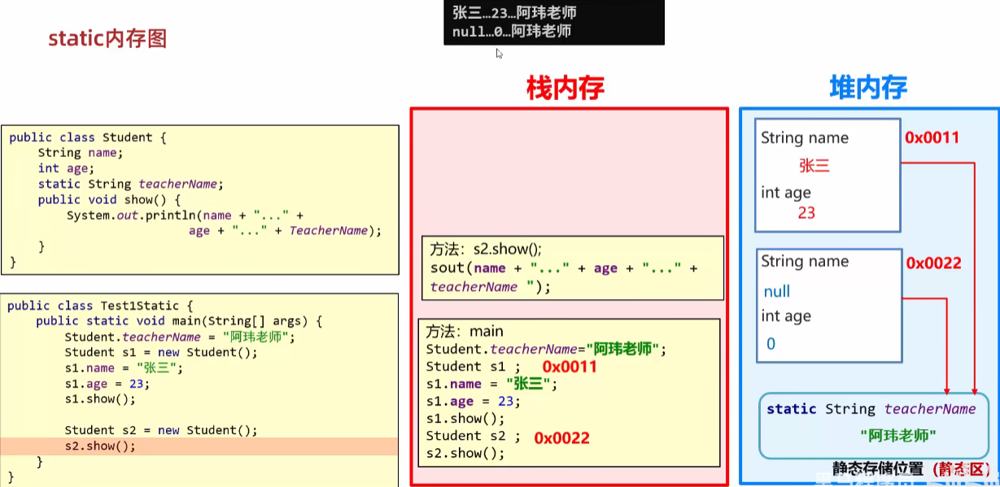

+ **静态方法:** 被static修饰的成员方法, 叫做静态方法

  + **特点:**

    + 多用在测试类和工具类中

      > + **工具类:** 帮助我们做一些事情的, 但是不描述任何事物的类
      >   + 类名见名知意
      >   + 私有化构造方法
      >   + 方法定义为静态
      >
      > ```java
      > public class ArrUtil {
      >     private ArrUtil() {}
      >     
      >     public static int getMax(...) {...}
      >     public static int getMin(...) {...}
      >     public static int getSum(...) {...}
      >     public static int getAvg(...) {...}
      > }
      > ```

    + Javabean类中很少会用

  + **调用方式:** 

    + 类名调用 (推荐)
    + 对象名调用

+ ==**注意事项:**==
  
  + 静态方法只能访问静态变量和静态方法
  + 非静态方法可以访问所有
  + 静态方法中没有this关键字

## 继承

+ `public class 子类 extends 父类 {}`
+ **好处**
  + 可以把多个子类中重复的代码抽取到父类中, 提高代码的复用性
  + 子类可以在父类的基础上, 增加其他的功能, 使子类更强大
+ **什么时候用继承?**
  + 当类与类之间存在相同的内容, 并满足子类是父类中的一种, 就可以考虑使用继承, 来优化代码

+ **特点**
  + Java只支持单继承, 不支持多继承, 但支持多层继承
  + 每一个类都直接或间接继承与Object类

+ **子类能继承父类中的哪些内容?**

  + |             | 构造方法 |   成员变量   |       成员方法       |
    | :---------: | :------: | :----------: | :------------------: |
    | **非私有**  |   不能   |      能      | 能加入虚方法表的, 能 |
    | **private** |   不能   | 能, 但不能用 |         不能         |

  + 只有父类中的虚方法才能被子类继承, 并不是一级一级向上访问
    +  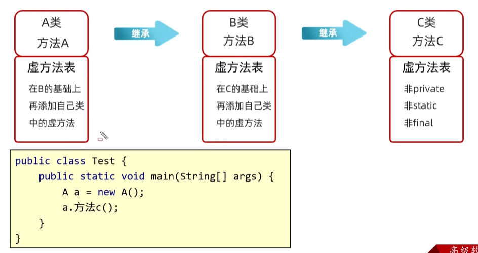

+ **成员变量的访问特点**
  + **就近原则:** 先在局部位置找, 本类成员位置找, 父类成员位置找, 逐级往上

+ **成员方法的访问特点**
  
  + **就近原则**
  + **方法重写**
    + 当父类的方法不能满足子类现在的需求时, 需要进行方法重写
    + 方法声明与父类一致
    + @Override重写注释
  + **方法重写的本质**
    +  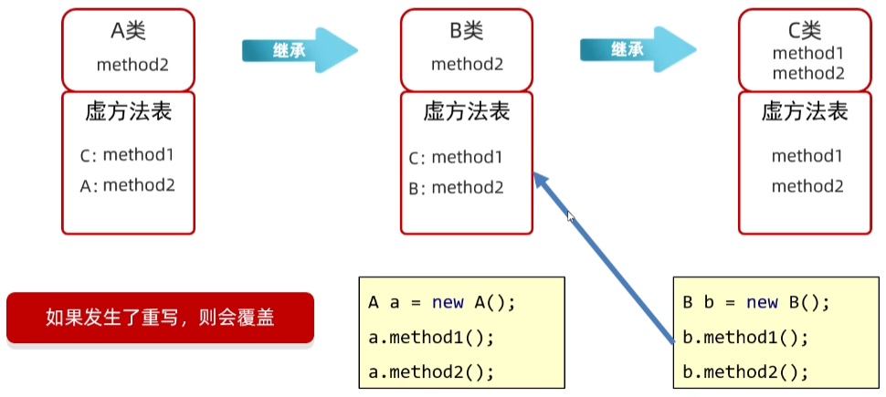
  + **注意事项**
    + 子类重写父类方法时, 访问权限子类必须大于等于父类 (空着不写 < protected < public)
    + 子类重写父类方法时, 返回值类型子类必须小于等于父类
    + **重写方法尽量与父类保持一致**
    + 只有被添加到虚方法表中的办法才能被重写
  
+ **构造方法的访问特点**
  + 父类中的构造方法不会被子类继承
  + 子类中所有的构造方法默认先访问父类中的无参构造, 再执行自己
  + 子类构造方法的第一行语句默认都是: **super(), 不写也存在, 且必须在第一行**
  + **如果想调用父类的有参构造, 必须手写super进行调用**
+ **this, super使用总结**
  +  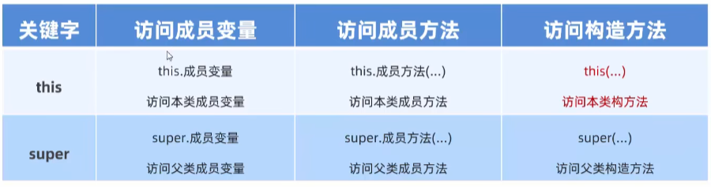
  + 在构造方法中调用本类的其他构造方法, **虚拟机不会再添加super()**, 因为调用的其他构造方法中也默认有super(), **且this()和super()一样只能在第一行**
  +  

## 多态

+ 同类型的对象, 表现出的不同形态

+ **表现形式:** `父类类型 对象名称 = 子类对象;`

+ **前提**

  + 有继承关系
  + 有父类引用指向子类对象
  + 有方法重写

+ **好处**

  + 使用父类型作为参数, 可以接受所有子类对象, 体现多态的扩展性与便利性

+ **调用成员的特点**

  + **变量调用:** 编译看左边, 运行也看左边
    + javac 编译代码的时候会看左边的父类中有没有这个变量, 如果有, 编译成功, 如果没有则编译失败
    + java 运行代码的时候, 实际获取的就是左边父类中成员变量的值
  + **方法调用:** 编译看左边, 运行看右边
    + javac 编译代码的时候会看左边的父类中有没有这个方法, 如果有, 编译成功, 如果没有则编译失败
    + java 运行代码的时候, 实际获取的就是子类中的方法
  + **内存图解**
    +  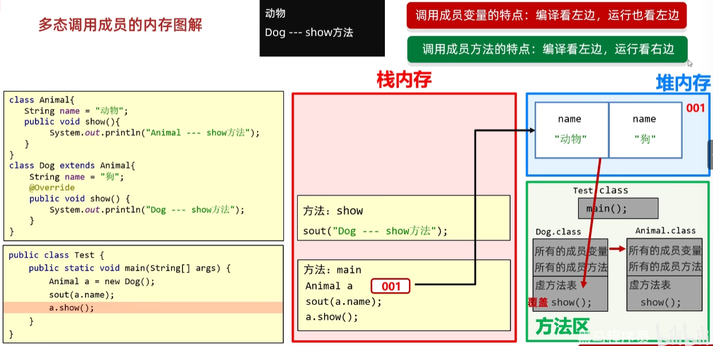

+ **优势**

  + 在多态形式下, 右边对象可以实现解耦合, 便于扩展和维护
  + 定义方法的时候, 使用父类型作为参数, 可以接收所有子类对象, 体现多态的便利性和扩展性

+ **弊端**

  + 不能使用子类的特有功能

  + **解决方法:** 强制类型转换

      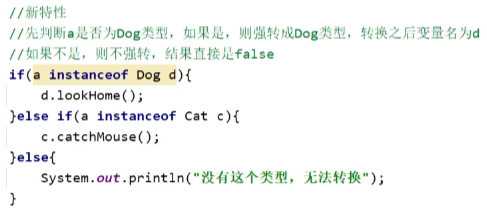

## 包

+ 包就是文件夹, 用来管理各种不同功能的 Java 类, 方便后期代码维护
+ **命名规则:** 公司域名反写 + 包的作用, 需要全部英文小写, 见名知意 (例如: com.itheima.domain)
+ **使用其他类的规则:** 使用其他包的类时, 需要使用全类名 (包名.类名) 或导包 (import)
  + 使用同一个包中的类时, 不需要导包
  + 使用 java.lang 包中的类时, 不需要导包
  + 其他情况都需要导包
  + 如果同时使用两个包中的同名类, 需要使用全类名

## final

+ **修饰方法:** 表明方法是最终方法, 不能被重写
+ **修饰类:** 表明该类是最终类, 不能被继承
+ **修饰变量:** 叫做常量, 只能被赋值一次
+ **命名规则**
  + **单个单词:** 全部大写
  + **多个单词:** 全部大写, 单词之间用下划线隔开
+ **修饰基本数据类型:** 记录的值不能发生改变
+ **修饰引用数据类型:** 记录的地址值不能发生改变, 内部的属性值**还是可以改变**的

## 权限修饰符

​     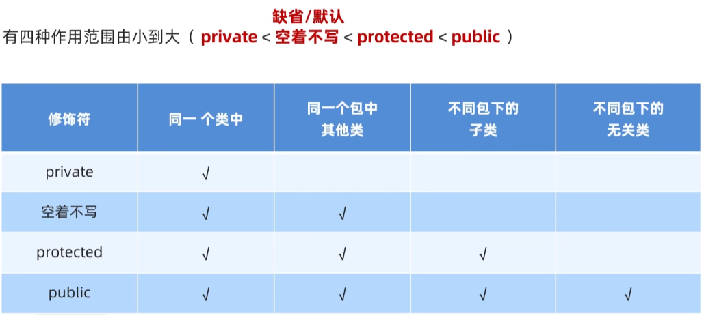

## 代码块

+ **局部代码块 (用于节约内存, 现在已经淘汰了)**
+ **构造代码块 (渐渐被淘汰了)**
  + 写在成员位置的代码块
  + 可以把多个构造方法中重复的代码抽取出来
  + **执行时机:** 在创建对象时先执行构造代码块, 再执行构造方法
+ **静态代码块**
  + **格式:** static{}
  + **特点:** 需要通过static关键字修饰, **随着类的加载而加载**, 并且自动触发, ==**只执行一次**==
  + **使用场景:** 在类加载的时候, 做一些数据初始化的时候使用

## 抽象类

+ **抽象方法:** 将**共性的**行为 **(方法)** 抽取到父类之后, 由于每一个子类执行的内容不一样, 在父类中不能确定**具体的方法体**, 该方法就可以定义为抽象方法
  + **定义格式:** `public abstract 返回值类型 方法名(参数列表);`
+ **抽象类:** 如果一个**类中存在抽象方法**, 该类就**必须声明为抽象类**
  + **定义格式:** `public abstract class 类名{}`
  + 强制子类按某种格式重写方法
+ **注意事项**
  + 抽象类不能实例化
  + 抽象类中不一定有抽象方法, 有抽象方法的类一定是抽象类
  + 可以有构造方法
  + 抽象类的子类
    + 要么重写抽象类中**所有的**抽象方法
    + 要么是抽象类

## 接口

​    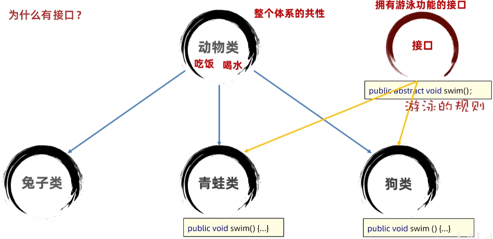

+ 接口是一种规则, 对**行为**的抽象, 想让哪个类拥有一个行为, 就让这个类实现对用的接口

+ 当一个方法的参数是接口时, 可以传递接口所有实现类的对象, 这种方法称为接口多态

+ **注意事项**

  + 接口用关键字 interface 来定义 `public interface 接口名{}`
  + 接口不能实例化, **但是用接口的实现类可以实例化，将实现类的对象在内存中的地址指向接口，这个接口就可以使用了** 
    + `接口 实例 = new 实现接口的类();`
  + 接口和类之间是实现关系, 通过 implements 关键字表示 `public class 类名 implements 接口名{}`
    + 可以单实现, 也可以多实现 `public class 类名 implements 接口名1, 接口名2{}`
    + 实现类还可以在继承一个类的同时实现多个接口 `public class 类名 extends 父类 implements 接口名1, 接口名2{}`
  + 接口的子类 (实现类)
    + 要么重写接口中所有的抽象方法
    + 要么是抽象类

+ **接口中成员的特点**

  + **成员变量**
    + 只能是常量
    + 默认修饰符: `public static final`
  + **构造方法:** **==没有==**
  + **成员方法**
    + 只能是抽象方法
    + 默认修饰符: `public abstract`

+ **接口和接口的关系**

  + 继承关系, 可以单继承, 也可以多继承

+ **JDK8以后接口中新增的方法**

  + 允许在接口中定义**默认方法**, 需要使用关键字 default 修饰

    + **作用:** 解决接口升级问题
    + 接口中**默认方法**的定义格式
      + **格式:** `public default 返回值类型 方法名(参数列表) {}`
      + **范例:** `public default void show() {}`
    + 接口中默认方法的**注意事项**
      + 默认方法不是抽象方法, 不强制重写, 但如果被重写, 重写时要去掉 default 关键字
      + public可以省略, default不能省略
      + 如果实现了多个接口, 多个接口中存在相同名字的默认方法, 子类就必须对该方法进行重写

  + 允许在接口中定义**静态方法**, 需要用关键字 static 修饰

    + 接口中**静态方法**的定义格式
      + **格式:** `public static 返回值类型 方法名(参数列表) {}`
      + **范例:** `public static void show() {}`

    + 接口中默认方法的**注意事项**
      + 静态方法只能通过接口名调用, 不能通过实现类名或者对象名调用
      + public可以省略, static不能省略

+ **JDK9接口中新增的方法**

  + 接口中**私有方法**的定义格式

    + 为**默认方法**服务
      + **格式:** `private 返回值类型 方法名(参数列表) {}`
      + **范例:** `private void show() {}`

    + 为**静态方法**服务

      + **格式:** `private static 返回值类型 方法名(参数列表) {}`

      + **范例:** `private static void show() {}`

+ **适配器设计模式**
  + 当一个接口中抽象方法过多, 但只要使用其中一部分的时候, 可以使用适配器设计模式
  + 书写步骤
    + 编写中间类 XXXAdapter, 实现对应的接口
    + 对接口中的抽象方法进行空实现
    + 让真正的实现类继承中间类, 并重写需要用的方法
    + 为了避免其他类创建适配器类的对象, 中间的适配器类用 abstract 进行修饰

## 内部类

+ 在一个类的里面再定义一个类

+ 内部类表示的事物是外部类的一部分, 单独存在没有意义
+ 内部类可以直接访问外部类的成员, 包括私有
+ 外部类要访问内部类的成员, 必须创建对象

+ **成员内部类**

  + 写在成员位置, 属于外部类的成员
  + 成员内部类可以被一些修饰符所修饰, 比如: private, 默认, protected, public, static等
  + 在成员内部类里面, JDK16开始可以定义静态变量
  + **获取成员内部类对象**
    + **方式一:** 在外部类编写方法, 对外提供内部类对象 (当内部类被private修饰时使用)
    + **方式二:** `外部类名.内部类名 对象名 = 外部类对象.内部类对象;`
      + **范例:** `Outer.Inner oi = new Outer().new Inner();`
  + 内存图

     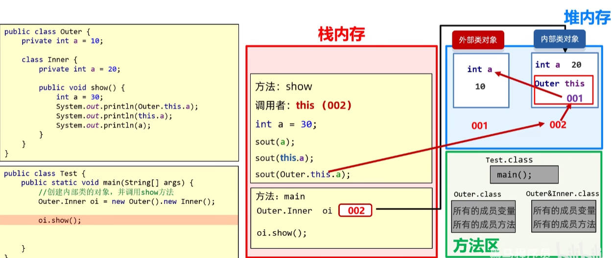

+ **静态内部类**

  + 静态内部类只能访问外部类中的静态变量和静态方法, 如果想要访问非静态的需要创建对象
  + 静态内部类也是成员内部类中的一种
  + **创建静态内部类对象的格式:** `外部类名.内部类名 对象名 = new 外部类名.内部类名();`

  + **调用静态内部类中的方法**
    + **调用非静态方法的格式:** 先创建对象, 用对象调用
    + **调用静态方法的格式:** `外部类名.内部类名.方法名()`

+ **局部内部类**
  + 将内部类定义在方法里面, 类似于方法里面的局部变量
  + 外界是无法直接使用局部内部类, 需要在方法内创建内部类对象并使用
  + 该类可以直接访问外部类的成员, 也可以访问方法内的局部变量

+ **匿名内部类**

  + 隐藏名字的内部类, 可以写在成员位置, 也可以写在局部位置

  + **格式:** `new 类名或接口名() { 重写方法; };`

    + ```java
      new Inter() {
          public void show() {
              // 方法体
          }
      };
      ```

    + 包含了继承或实现, 方法重写, 创建对象
    + 整体就是一个类的子类对象或者接口的实现类对象

  + **使用场景**

    + 当方法的参数是接口或类时, 以接口为例, 可以传递这个接口的实现类对象, 如果实现类只要使用一次, 就可以用匿名内部类简化代码


# 集合

   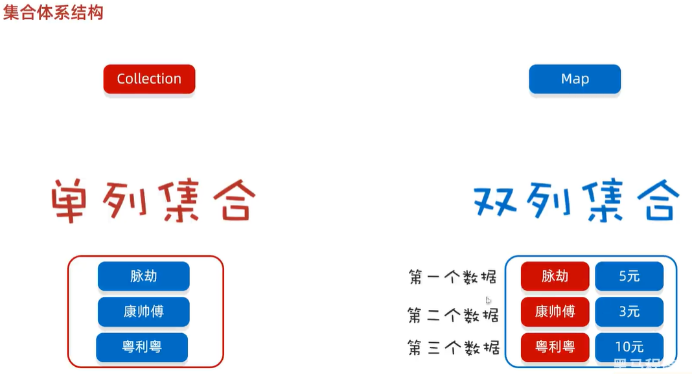

## 泛型

+ JDK5引入的特性, 可以在编译阶段约束操作的数据类型, 并进行检查
+ 泛型中不能写基本数据类型
+ 指定泛型的具体类型后, 传递数据时, 可以传入该类类型或其子类型
+ 如果不写泛型, 类型默认是Object
+ **泛型可以在很多地方上定义**
  + **泛型类**
    + 当一个类中, 某个变量的数据类型不确定时, 就可以定义带有泛型的类
  + **泛型方法**
    + 方法中形参类型不确定时使用
    + `修饰符<类型> 返回值类型 方法名(类型 变量名) {}`
  + **泛型接口**
    + `修饰符 interface 接口名<类型> {}`
    + 可在实现类中实现泛型, 或在实现类中继续使用泛型, 在创建对象时再实现泛型
+ 泛型不具备继承性, 但数据具备继承性
+ **泛型通配符**
  + ? 表示不确定的类型, 它可以进行**类型的限定**
  + ? extends E : 表示可以传递E或者E所有的子类类型
  + ? super E : 表示可以传递E或者E所有的父类类型
+ **应用场景**
  + 如果我们定义类, 方法, 接口的时候, 如果类型不确定, 就可以定义泛型类, 泛型方法, 泛型接口
  + 如果类型不确定, 但是能知道以后只能传递某个体系中的类型, 就可以使用泛型的通配符

## Collection

​     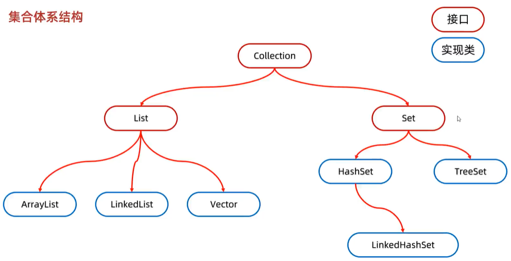

+ Collection是单列集合的祖宗接口, 它的功能是全部单列集合都可以继承使用的

+ **常用方法**

  + boolean add(E e)
  + void clear()
  + boolean remove(E e)
  + boolean contains(Object obj)
    + 底层是依赖[equals方法](# Object)进行判断是否存在的, 如果集合中存储的 是自定义对象, 也想通过contains方法来判断是否包含, 那么在Javabean类中, **一定要重写equals方法**
  + boolean isEmpty()
  + int size()

+ **Collection的遍历方式**
  + **迭代器遍历**
    + 不依赖索引
    + 迭代器在Java中的类是**Iterator**, 迭代器是集合专用的遍历方式
    + **Collection集合获取迭代器**
      + Iterator<E\> iterator() : 返回迭代器对象, 默认指向当前集合的0索引
    + **Iterator中的常用方法**
      + boolean hasNext() : 判断当前位置是否有元素
      + E next() : 获取当前位置的元素, 并将迭代器对象移向下一个位置
      + void remove()
    + **注意点**
      + 报错NoSuchElementException
      + 迭代器遍历完毕, 指针不会复位, 如果要二次遍历, 只能重新创建迭代器对象
      + 循环中只能用一次next方法
      + 迭代器遍历时, 不能用集合的方法进行增加或删除, 如果要删除, 要使用迭代器的remove方法
    
  + **增强for遍历**
    + 增强for的底层就是迭代器, 为了简化迭代器的代码书写, JDK5之后出现
    + 所有**单列集合**和**数组**才能用增强for进行遍历
    + **细节**
      + 修改增强for的变量, 不会改变集合中原本的数据
    
  + **Lambda表达式遍历**

    + JDK8后出现

    + default void forEach(Consumer<? super T> action)

      + ```java
        // 匿名内部类写法
        coll.forEach(new Consumer<String>() {
            @Override
            publlic void accept(String s) {
                // s依次表示集合中的每一个元素
            }
        });
        
        // Lambda写法
        coll.forEach(s -> System.out.println(s));
        ```

  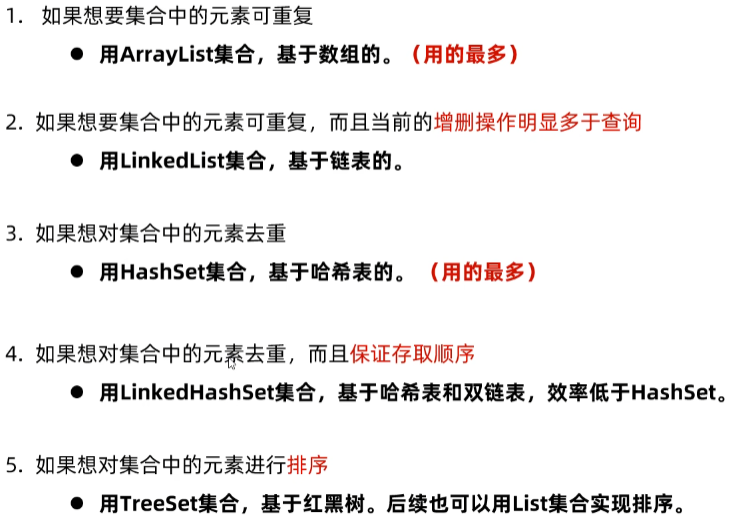

### List

+ 添加的元素是有序, 可重复, 有索引
+ **常用方法**
  + void add(int index, E e)
  + E remove(int index)
  + E set(int index, E e)
  + E get(int index)
+ **List集合的遍历方式**
  + 迭代器遍历
  + 列表迭代器遍历
    + ListIterator<E\>  listIterator()
    + 可用于给列表添加元素
      + void add(E e)
  + 增强for遍历
  + Lambda遍历
  + 普通for循环

#### ArrayList

+ **底层原理**
  + 利用空参创建的集合, 在底层创建一个默认长度为0的数组
  + 添加第一个元素时, 底层会创建一个新的长度为10的数组
  + 存满时, 会扩容1.5倍
  + 如果一次添加多个元素, 1.5倍也放不下时, 则新创建数组的长度以实际为准

#### LinkedList

+ 底层数据结构是双链表
+ **特有方法**
  + void addFirst(E e)
  + void addLast(E e)
  + E getFirst()
  + E getLast()
  + E removeFirst()
  + E removeLast()

### Set

+ 添加的元素是无序, 不重复, 无索引
+ Set集合的方法基本上与Collection的API一致

#### HashSet

+ **无序**, 不重复, 无索引

+ **要求数据去重时使用**

+ 底层采用**哈希表**存储数据

  + **哈希表组成**

    + JDK8之前 : 数组 + 链表

      1. 创建一个默认长度为16, 默认加载因子为0.75 (当数组内元素数量为 数组长度 * 加载因子 时, 数组自动扩容) 的数组, 数组名为table

         ​	`HashSet<String> hm = new HashSet<>();`

      2. 根据元素的哈希值跟数组的长度计算出应存入的位置 

         ​	`int index = (数组长度 - 1) & 哈希值;`

      3. 判断当前位置是否为null, 如果是null直接存入

      4. 如果位置不为null, 表示有元素, 则调用equals方法比较属性值

      5. 一样: 不存 ; 不一样: 存入数组, 形成链表

         + JDK8以前: 新元素存入数组, 老元素挂在新元素下面
         + JDK8以后: 新元素直接挂在老元素下面

    + JDK8开始 : 数组 + 链表 + 红黑树

      + 当链表长度**超过8**, 且数组长度**大于等于64**时, 自动转换为红黑树

  + **哈希值**

    + 根据hashCode方法算出来的int类型的整数
    + 该方法定义在Object类中, 所有对象都可以调用, 默认使用地址值进行计算
    + 一般情况下, 会**重写hashCode方法**, 利用对象内部的属性值计算哈希值

  + **对象的哈希值特点**

    + 如果没有重写hashCode方法, 不同对象计算出的哈希值是不同的
    + 如果已经重写hashCode方法, 不同的对象只要属性值相同, 计算出的哈希值就是一样的
    + 在小部分情况下, 不同的属性值或者不同的地址值计算处理的哈希值也有可能一样 (哈希碰撞)

  + **存储自定义对象时, 要重写hashCode方法**

##### LinkedHashSet

+ **有序**, 不重复, 无索引
+ **要求数据去重且存取有序时使用**
+ 这里的有序指存储和取出的元素顺序一致
+ **原理:** 底层数据结构依然是哈希表, 只是每个元素又额外多了一个双链表的机制记录存储顺序

#### TreeSet

+ **可排序**, 不重复, 无索引

+ 底层基于**红黑树**的数据结构实现排序的, 增删改查性能都较好

+ **默认规则**

  + 对于数值类型: Integer, Double, 默认按照从小到大的顺序进行排序
  + 对于字符, 字符串类型: 按照字符在ASCII码表中的数字升序进行排序

+ **TreeSet的两种比较方式**

  + **默认排序/自然排序:** Javabean类实现Comparable接口指定比较规则

    + ```java
      // 在Javabean类实现Comparable接口, Comparable接口是带泛型的, 可在实现接口的时候就确定泛型, 泛型即为该Javabean类
      // 在Javabean类中实现Comparable接口中的compareTo方法
      @Override
      public int compareTo(E e) {
          // e: 表示已经在红黑树存在的元素
          // this: 表示当前要添加的元素
          // 返回值:
          // 负数: 表示当前要添加的元素是小的, 存左边
          // 正数: 表示当前要添加的元素是大的, 存右边
          // 0: 表示当前要添加的元素已经存在, 舍弃
          return 0;
      }
      ```

  + **比较器排序:** 创建TreeSet对象的时候, 传递比较器Comparator指定规则

    + ```java
      TreeSet<E> ts = new TreeSet<>(new Comparator<E>() {
          @Override
          public int compare(E e1, E e2) {
              // e1: 表示当前要添加的元素
              // e2: 表示已经在红黑树中的元素
              // 返回值同上
              retrun 0;
          }
      });
      ```

  + **默认采用第一种, 当第一种排序无法满足时, 使用第二种**

  + **当两种同时存在时, 使用的是第二种**

## Map

​      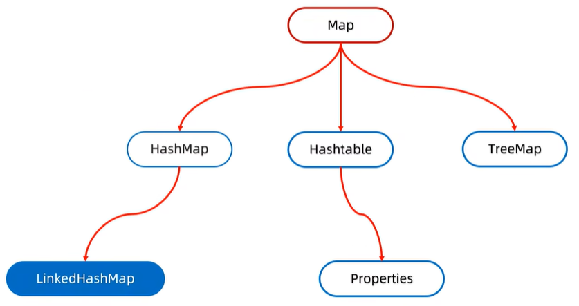

+ **特点**

  + 双列集合一次需要存一对数据, 分别为键和值
  + 键不能重复, 值可以重复
  + 键和值是一一对应的, 每一个键只能找到自己对应的值
  + 键 + 值 这个整体称之为"键值对", 记作"Entry对象"

+ **常用方法细节**

  + V put(K key, V value) : 添加数据
    + 在添加数据的时候, 如果键不存在, 那么直接把键值对对象添加到Map集合当中
    + 在添加数据的时候, 如果键存在, 那么会把原有的键值对对象覆盖, 会把被覆盖的值进行返回
  + V remove(Object key) : 根据键删除键值对元素
    + 返回被删除的值

+ **Map的遍历方式**

  + **通过键找值**

    ```java
    // 获取所有的键, 把这些键放到一个单列集合当中
    Set<String> keys = map.keySet();
    // 遍历单列集合, 得到每一个键
    for (String key : keys) {
        String value = map.get(key);
    }
    ```

  + **通过键值对遍历**

    ```java
    // 获取所有的键值对对象, 返回一个集合
    Set<Map.Entry<String, String>>  entries = map.entrySet();
    // 遍历entryies这个集合, 去得到里面的每一个键值对对象
    for (Map.Entry<String, String> entry : entries) {
        String key = entry.getKey();
        String value = entry.getValue();
    }
    ```

  + **通过Lambda表达式遍历**

    ```java
    // 利用Lambda表达式遍历
    map.forEach((key, value) -> sout(key + "=" + value));
    // 底层为通过键值对遍历
    ```

### HashMap

+ **无序**, 不重复, 无索引
  + 针对的是**键**
  + 如果键存储的是自定义对象, 需要重写hashCode和equals方法; 如果值存储自定义对象, 不需要重写hashCode和equals方法
+ **底层:** 和HashSet一样

#### LinkedHashMap

+ **有序**, 不重复, 无索引
  + 针对的是**键**
  + 有序指的是保证存储和取出的元素顺序一致
+ **原理:** 底层数据结构是哈希表, 只是每个键值对元素又额外的多了一个双链表的机制记录存储的顺序

### TreeMap

+ 不重复, 无索引, **可排序**
  + 可排序: 对键进行排序
  + **默认按键的从小到大进行排序, 也可以自己规定键的排序规则**
+ 增删改查性能较好
+ **底层:** 和TreeSet一样
+ **代码书写两种排序规则**
  + 实现**Comparable**接口, 指定比较规则
  + 创建集合时传递**Comparator**比较器对象, 指定比较规则
  + 与[TreeSet](#TreeSet)的规则一样

## 可变参数

+ 方法形参的个数时可以发生变化的
+ **格式:** `数据类型...名字`
+ **例子:** `public static int getSum(int...args) {}`
+ **细节**
  + 可变参数本质上就是一个数组
  + 在方法的形参中最多只能写一个可变参数
  + 在方法中, 如果除了可变参数外还有其他的形参, 那么可变参数要写在最后

## Collections

+ 集合工具类

+ **常用方法**

    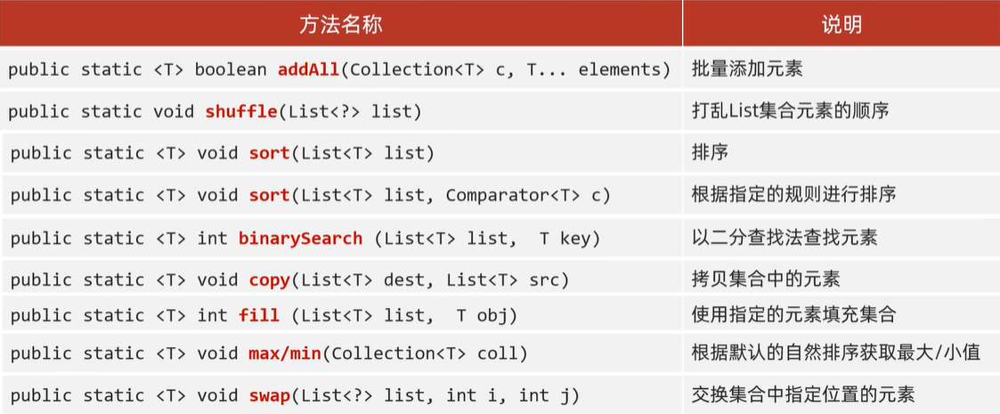

## 不可变集合

+ **特点:** 定义完成后不可以修改, 添加, 删除
+ **如何创建:** List, Set, Map接口中, 都存在**of**方法可以创建不可变集合
+ **细节**
  + **List:** 直接用
  + **Set:** 元素不能重复
  + **Map:** 元素不能重复, 键值对数量最多是10个, 超过10个用**ofEntry**方法


# Stream流

## 作用

+ 结合了Lambda表达式, 简化集合和数组的操作

## 使用步骤

+ 先得到一条Stream流(流水线), 并把数据放上去

  | 获取方式     | 方法名                                       | 说明                     |
  | :----------- | :------------------------------------------- | ------------------------ |
  | 单列集合     | default Stream<E> stream()                   | Collection中的默认方法   |
  | 双列集合     | 无                                           | 无法直接使用Stream流     |
  | 数组         | public static<T> Stream<T> stream(T[] array) | Arrays工具类中的静态方法 |
  | 一堆零散数据 | public static<T> Stream<T> of(T... values)   | Stream接口中的静态方法   |

+ 使用**中间方法**对流水线上的数据进行操作

  | 名称                                             | 说明                                 |
  | ------------------------------------------------ | ------------------------------------ |
  | Stream<T> filter(Predicate<? super T> predicate) | 过滤                                 |
  | Stream<T> limit(long maxSize)                    | 获取前几个元素                       |
  | Stream<T> skip(long n)                           | 跳过前几个元素                       |
  | Stream<T> distinct()                             | 元素去重, 依赖(hashCode和equals方法) |
  | static<T> Stream<T> concat(Stream a, Stream b)   | 合并a和b两个流为一个流               |
  | Stream<R> map(Function<T, R> mapper)             | 转换流中的数据类型                   |

  + **注意1:** 中间方法, 返回新的Stream流, 原来的Stream流只能使用一次, 建议使用链式编程
  + **注意2:** 修改Stream流中的数据, 不会影响原来集合或者数组中的数据

+ 使用**终结方法**对流水线上的数据进行操作

  | 名称                          | 说明                       |
  | :---------------------------- | -------------------------- |
  | void forEach(Consumer action) | 遍历                       |
  | long count()                  | 统计                       |
  | toArray()                     | 收集流中的数据, 放到数组中 |
  | collect(Collector collector)  | 收集流中的数据, 放到集合中 |


# 方法引用

+ 把已经有的方法拿过来用, 当做函数式接口中抽象方法的方法体
+ **条件**
  + 引用处必须是函数式接口
  + 被引用的方法必须已经存在
  + 被引用方法的形参和返回值需要跟抽象方法保持一致
  + 被引用方法的功能要满足当前需求
+ **方法引用符:** `::`

## 分类

+ **引用静态方法**
  + **格式:** 类名 : : 静态方法
  + **范例:** `Integer::parseInt`
+ **引用成员方法**
  + **格式:** 对象 : : 成员方法
    + **其他类:** 其他类对象 : : 方法名
    + **本类:** this : : 方法名
    + **父类:** super : : 方法名
+ **引用构造方法**
  + **格式:** 类名 : : new
  + **范例:** `Student::new`
+ **其他调用方式**
  + **使用类名引用成员方法**
    + **格式:** 类名 : : 成员方法
    + **范例:** `String::subString`
    + **第三条条件变为:** 被引用方法的形参, 需要跟抽象方法的第二个形参到最后一个形参保持一致, 返回值保持一致
    + **第一个参数:** 表示被引用方法的调用者, 决定了可以引用哪些类中的方法. 在Stream流中, 第一个参数一般都表示流里面的每一个数据. 假设流里面的数据是字符串, 那么使用这种方式进行方法引用, 只能引用String这个类中的方法
    + **第二个参数到最后一个参数:** 跟被引用方法的形参保持一致, 如果没有第二个参数, 说明被引用的方法需要是无参的成员方法
  + **引用数组的构造方法**
    + **格式:** 数据类型[] : : new
    + **范例:** `int[]::new`
    + **细节:** 数组的类型, 需要跟流中数据的类型保持一致


# 异常

  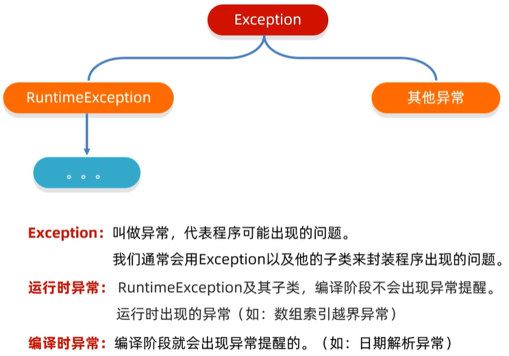

  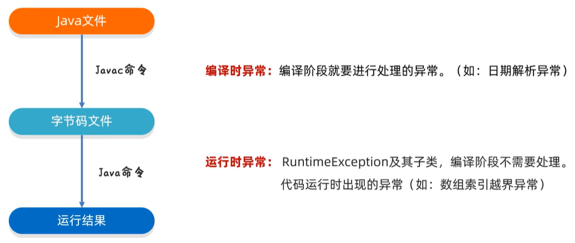

## 作用

+ 异常是用来查询bug的关键参考信息
+ 异常可以作为方法内部的一种特殊返回值, 以便通知调用者底层的执行情况

## 处理方式

+ **JVM默认的处理方式**

  + 把异常的名称, 异常原因及异常出现的位置等信息输出在了控制台
  + 程序停止执行, 异常下面的代码不会再执行了

+ **自己处理(捕获异常)**

  + **格式**

    ```java
    try {
        // 可能出现异常的代码;
    } catch(异常类名 变量名) {
        // 异常的处理代码;
    } finally {
        // 一定被执行, 除法虚拟机终止;
    }
    ```

  + **目的:** 当代码出现异常时, 可以让程序继续往下执行

  + **如果try中遇到的问题没有被捕获, 怎么执行?**

    + 相当于try...catch的代码白写了, 最终还是会交给虚拟机进行处理

  + **如果try中遇到了问题, 那么try下面的其他代码还会执行吗?**
  
    + 下面的代码不会执行, 直接跳转到对应的catch当中执行

## 常见方法

| 方法                          | 说明                            |
| ----------------------------- | ------------------------------- |
| public String getMessage()    | 返回此throwable的详细消息字符串 |
| public String toString()      | 返回此可能出现的简短描述        |
| public void printStackTrace() | 把异常的错误信息输出在控制台    |

## 抛出处理

  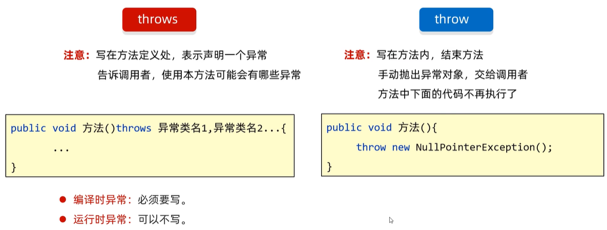

## 自定义异常

+ 定义异常类
+ 写继承关系
+ 空参构造
+ 带参构造


# File

+ File对象就表示一个路径, 可以是文件的路径, 也可以是文件夹的路径
+ 这个路径可以是存在的, 也允许是不存在的

## 常见构造方法

| 方法名称                                 | 说明                                               |
| ---------------------------------------- | -------------------------------------------------- |
| public File(String pathName)             | 根据文件路径创建文件对象                           |
| public File(String parent, String child) | 根据父路径名字符串和子路径名字符串创建文件对象     |
| public File(File parent, String child)   | 根据父路径对应文件对象和子路径名字符串创建文件对象 |

## 成员方法细节

+ `public long length()` 只能获取文件的大小, 单位是字节, 不能获取文件夹大小
+ `public boolean delete()` 删除文件和空文件夹, 不走回收站; 不能删有内容的文件夹
+ `public File[] listFiles()` 获取权限内文件夹里的所有文件(包含隐藏文件)和文件夹的路径, 以数组形式返回


# IO流

> 用于读写文件或网络中的数据, 以程序为参照

   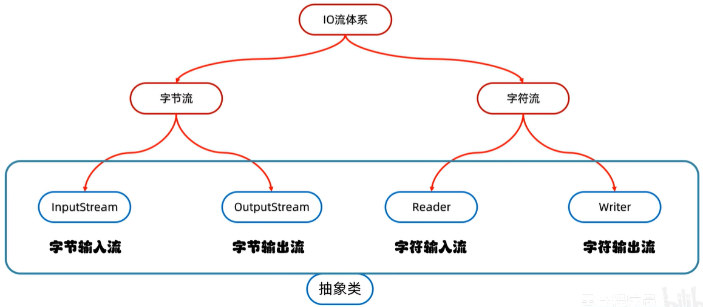

## 字节流

### InputStream

#### FileInputStream

+ **创建字节输入流对象**

  + 文件不存在直接报错

+ **读数据**

  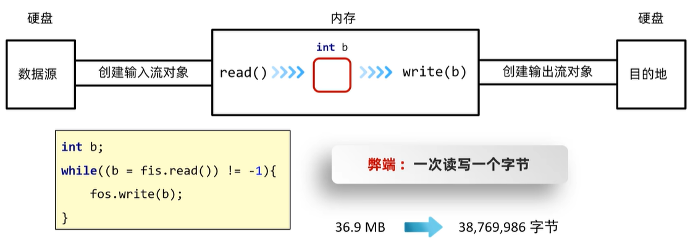

  + 一次读一个字节, 读出的数据为在ASCII上对应的数字

  + 读到文件末尾了, read方法返回-1

  + **循环读取**

    ```java
    // 循环读取一个字节数据
    int b;
    while((b = fis.read()) != -1) {
        sout((char) b);
    }
    
    // 循环读取一个容量大小的字节数据
    int len;
    byte[] bytes = new byte[1024 * 1024 * 5];
    while((len = fis.read(bytes)) != -1) {
        sout(new String(bytes, 0, len));
    }
    ```

+ **释放资源**

  + 每次使用完流后都要释放资源

### OutputStream

#### FileOutputStream

+ **创建字节输出流对象**
  + 参数是字符串表示的路径或者是File对象都是可以的
  + 如果文件不存在会创建一个新的文件, 但是要保证父级路径是存在的
  + 如果文件已经存在, 则会清空文件, 可以通过第二个参数打开续写
+ **写数据**
  + write方法的参数是整数, 但是实际上写到本地文件中的是对应的ASCII字符
  + 可以写出字节数组
  + 换行符 `\r\n`
+ **释放资源**
  + 每次使用完流后都要释放资源

## 字符集

+ **ASCII:** 英文字符, 一个字节

  + **编码规则:** 前面补0, 补齐8位
  + **解码规则:** 直接转成十进制

+ **GBK:** 简体中文版Windows默认使用

  + **英文**用一个字节存储, 完全兼容ASCII 
    + **编码规则:** 前面补0, 补齐8位
  + **汉字**两个字节存储, 高位字节二进制一定以1开头, 转成十进制之后是一个负数
    + **编码规则:** 不需要变动
    + **解码规则:** 直接转成十进制

+ **Unicode**

  + **UTF-8编码规则:** 用1~4个字节保存

      ​    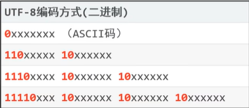

+ **避免乱码**

  + 不要用字节流读取文本文件
  + 编码解码时使用同一个码表, 同一个编码方式

### Java中编码和解码方法

+ **编码**

  ```java
  public byte[] getBytes()					// 使用默认方式编码
  public byte[] getBytes(String charsetName)	// 使用指定方式编码
  ```

+ **解码**

  ```java
  String(byte[] bytes)						// 使用默认方式解码
  String(byte[] bytes, String charsetName)	// 使用指定方式解码
  ```

## 字符流

> 字符流 = 字节流 + 字符集

### Reader

#### FileReader

+ **创建字符输入流对象**

  + **底层:** 关联文件, 并创建缓冲区(长度为8192的字节数组)

+ **读取数据**

  + **底层:**
    + 判断缓冲区中是否有数据可以读取
    + **缓冲区没有数据**
      + 就从文件中获取数据, 装到缓冲区中, 每次尽可能装满缓冲区
      + 如果文件中也没有数据了, 返回-1

    + **缓冲区有数据:** 从缓冲区中读取


  + 按字节进行读取, 遇到中文, 一次读多个字节, 读取后解码, 返回整数

  ```java
  // 读取数据, 读到末尾返回-1
  // 一次读取一个字节, 遇到中文一次读多个字节, 把字节解码并转成十进制返回
  public int read()
      
  // 读取多个数据, 读到末尾返回-1, 返回值是读出的长度
  // 把读取字节, 解码, 强转三步合并, 强转之后的字符放到数组中
  public int read(char[] buffer)
  ```

+ **释放资源**

### Writer

#### FileWriter

+ **创建字符输出流对象**
  + **底层:** 也会创建长度为8192的缓冲区
  + 参数是字符串表示的路径或者File对象都是可以的
  + 如果文件不存在会创建一个新的文件, 但要保证父级路径是存在的
  + 如果文件已经存在, 则会清空文件, 如果不想清空可以打开续写开关
+ **写数据**
  + **底层:** 填满缓冲区, 手动flush, close都会写入数据
  + 如果write方法的参数是整数, 实际写到文件中的是对应的ASCII字符
  + 根据字符集的编码方式进行编码, 把编码之后的数据写到文件中
+ **释放资源**

## 字节流和字符流的使用场景

+ **字节流:** 拷贝任意类型的文件
+ **字符流:** 读取纯文本文件中的数据, 往纯文本文件中写出数据

## 缓冲流

### 字节缓冲流

   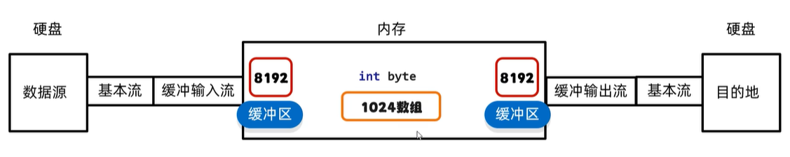

+ 在构造方法时其实就是将基本流进行包装

  ```java
  public BufferedInputStream(InputStream is)
  public BufferedOutputStream(OutputStream os)
  ```

+ 关流时只要关闭缓冲流

### 字符缓冲流

+ 由于字符流已有缓冲区, 故字符缓冲流对效率影响不大

+ **特殊方法**

  ```java
  public BufferedReader(Reader r)
  // 在读取时, 一次读一整行, 遇到回车换行结束, 但不会读入回车换行, 遇到末尾返回null
  public String readLine()
      
  public BufferedWriter(Writer r)
  // 跨平台的换行
  public void newLine()
  ```

## 转换流

> 字符流和字节流之间的桥梁

​    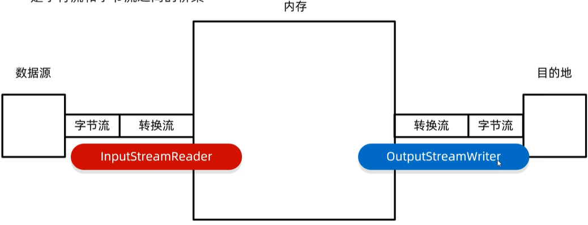

```java
// 字符转换输入流
InputStreamReader
// 字符转换输出流
OutputStreamWriter
```

+ 当字节流想要使用字符流中的方法时可以使用
+ 指定字符集读写数据(JDK11后淘汰)

## 序列化流

> 可以把java中的对象写到本地文件中

```java
// 把基本流包装成高级流
public ObjectOutputStream(OutputStream out)
    
// 把对象序列化(写出)到文件中去
public final void writeObject(Object obj)
```

+ 要给对象实现Serializable接口
  + 这个接口里没有抽象方法, 是**标记型接口**
  + 一旦实现该接口, 就表示当前对象可以被序列化

## 反序列化流

> 可以把序列化到本地文件中的对象读取到程序中

```java
// 把基本流变成高级流
public ObjectInputStream(InputStream out)

// 可以把序列化到本地文件中的对象读取到程序中
public Object readObject()
```

## 序列化流和反序列化流细节汇总

+ 使用序列化流将对象写到文件时, 需要让javaBean类实现Serializable接口, 否则会出现`NotSerializableException`异常
+ 序列化流写到文件中的数据是不能修改的, 一旦修改就无法再次读回来了
+ 序列化对象后, 修改了javaBean类, 再次反序列化会出现问题, 会抛出`InvalidClassException`异常
  + **解决方案:** 给JavaBean类添加serialVersionUID(序列号, 版本号)
+ 如果一个对象中的某个成员变量的值不想被序列化, 可以给该成员变量添`transient`关键字修饰, 该关键字标记的成员变量不参与序列化过程
+ 规范下将对象放入集合中读写, 前提集合实现Serializable接口

## 打印流

+ 只有输出流, 只能操作文件目的地, 不操作数据源
+ **特有**的写出方法可以实现, 数据原样写出
+ **特有**的写出方法, 可以实现自动刷新, 自动换行
  + 打印一次数据 = 写出 + 换行 + 刷新
+ `PrintStream ps = System.out;`
  + 获取打印流对象, 此打印流在虚拟机启动的时候, 由虚拟机创建, 默认指向控制台
  + 特殊的打印流, 系统中的标准输出流, **不能关闭**, **在系统中是唯一的**

### 字节打印流

+ 字节流底层没有缓冲区, 构造方法时开不开自动刷新都一样
+ **构造方法:** `public PrintStream(...)`

#### 特有方法

```Java
// 打印任意数据, 自动刷新, 自动换行
public void println(Xxx xx)

// 打印任意数据, 不换行
public void print(Xxx xx)

// 带有占位符的打印语句, 不换行
public void printf(String format, Object... args)
```

### 字符打印流

+ 字符流底层有缓冲区, 想要自动刷新需要开启
+ **构造方法:** `public PrintWriter(...)`

#### 特有方法

+ 与**字节打印流的特有方法**一样

## 解压缩流

+ **解压的本质:** 把压缩包里面的每一个文件或文件夹读取出来, 按照**层级拷贝**到目的地中
+ Java中压缩包中的文件(夹)实际上是一个个`ZipEntry`对象

```java
// 创建一个解压缩流用来读取压缩包中的数据
ZipInputStream zip = new ZipInputStream(new FileInputStream(src));
// 获取压缩包里的每一个ZipEntry对象
ZipEntry entry;
while((entry = zip.getNextEntry()) != null) {
    if (entry.isDirectory()) {
        File file = new File(dest, entry.toString());
        file.mkdirs();
    } else {
        FileOutputStream fos = new FileOutputStream(new File(dest, entry.toString());
        int b;
        while((b = zip.read()) != -1) {
            // 写到目的地
            fos.write(b);
        }
        fos.close();
        // 表示压缩包中的一个文件处理完毕了
        zip.closeEntry();
    }
}
zip.close();
```

## 压缩流

```java
/*
 * 压缩文件
 */
// 创建压缩流关联压缩包
ZipOutputStream zos = new ZipOutputStream(new FileOutputStream(new File(dest, "a.zip")));
// 创建ZipEntry对象, 表示压缩包里面的每一个文件和文件夹
ZipEntry entry = new ZipEntry("a.txt");
// 把ZipEntry对象放到压缩包当中
zos.putNextEntry(entry);
FileInputStream fis = new FileInputStream(src);
int b;
while((b = fis.read()) != -1) {
    zos.write(b);
}
zos.closeEntry();
zos.close();

/*
 * 压缩文件夹
 */
// 见 E:\FileOpe\FileOpeHelper.java
```

## 常用工具类

> 导包见 E:\JavaLib

### Commons-io

### Hutool

## Properties配置文件

+ properties是一个双列结合, 拥有Map集合所有的特点
+ 拥有IO特性, 特有的 store 和 load 方法, 处理 .properties 文件


# 多线程

+ **线程**
  + 操作系统能够进行运算调度的最小单位。它被包含在**进程**之中，是进程中的实际运作单位
  + **简单理解:** 应用软件中互相独立, 可以同时运行的功能

## 并发和并行

+ **并发:** 在同一时刻, 有多个指令在**单个**CPU上**交替**执行
+ **并行:** 在同一时刻, 有多个指令在**多个**CPU上**同时**执行

## 实现方式

+ **继承Thread类的方式进行实现**
  + 定义一个类继承Thread
  + 重写run方法
  + 创建子类的对象, 并启动线程
+ **实现Runnable接口的方式进行实现**
  + 定义一个类实现Runnable接口
  + 重写run方法
  + 创建自己的类的对象
  + 创建一个Tread类的对象, 并开启线程
+ **利用Callable接口和FutureTask对象的方式实现**
  + **特点:** 可以获取到多线程运行的结果
  + 创建一个类MyCallble实现Callable接口
  + 重写call (有返回值, 表示多线程运行的结果)
  + 创建MyCallble对象 (表示多线程要执行的任务)
  + 创建FutureTask对象 (管理多线程运行的结果)
  + 创建Thread类的对象, 并启动

## 常用成员方法

```java
/*
 * 返回此线程的名称
 */
String getName();

/*
 * 设置线程的名字(也可以用构造方法设置)
 * 如果没有给线程设置名字, 线程也是有默认的名字的, 格式: Thread-X (X序号, 从0开始)
 */
void setName(String name)
    
/*
 * 获取当前线程的对象
 */
static Thread currentThread()
    
/*
 * 让线程休眠指定的时间, 单位为ms
 * 哪条线程执行到这个方法, 那么哪条线程就会在这停留对应的时间
 */
static void sleep(long time)
    
/*
 * 设置线程的优先级
 * 最小为1, 最大为10, 默认为5
 */
setPriority(int newPriority)
    
/*
 * 获取线程的优先级
 */
final int getPriority()
    
/*
 * 设置为守护线程(备胎线程)
 * 当其他的非守护线程执行完毕之后, 守护线程会陆续结束
 */
final void setDaemon(boolean on)
    
/*
 * 出让线程/礼让线程
 */
public static void yield()
    
/*
 * 插入线程/插队线程
 * 将方法调用者的线程插入到当前线程之前
 */
public final void join()
```

## 安全问题

### 同步代码块

+ 把操作共享数据的代码锁起来

+ **格式**

  ```java
  // 锁对象是任意的, 但一定要唯一, static修饰
  // 如: static Object obj = new Object();
  synchronized (锁对象) {
      // 操作共享数据的代码;
  }
  ```

+ **特点**

  + 锁默认打开, 有一个线程进去了, 锁自动关闭
  + 里面的代码全部执行完毕, 线程出来, 锁自动打开

### 同步方法

+ 把`synchronized`关键字加到方法上

+ **格式:** `修饰符 synchronized 返回值类型 方法名(方法参数) {...}`

+ **特点**

  + 同步方法是锁住方法里面所有的代码
  + 锁对象不能自己指定
    + **非静态:** `this`
    + **静态:** 当前类的字节码文件对象


### Lock锁

+ Lock实现提供比使用`synchronized`方法和语句可以获得更广泛的锁定操作

```java
// Lock是接口不能直接实例化, 这里采用它的实现类ReentrantLock来实例化
static Lock lock = new ReentrantLock();

public void run() {
    while(true) {
        lock.lock(); // 上锁
        try {
            // 操作共享数据的代码
        } catch() {
            // 异常捕获
        } finally {
            lock.unlock(); // 解锁
        }
    }
}
```

## 生产者和消费者

+ 又称**等待唤醒机制**, 是一个经典的多线程协作模式

+ 以厨师与食客为例

  ```java
  // 以桌子作为联系两个线程的中介
  public class Dest {
      public static int foodFlag = 0;
      public static int count = 10;
      public static final Object lock = new Object();
  }
  
  public class Cook extends Thread {
      @Override
      public void run() {
          /*
           * 写安全线程的套路:
           * 		1.循环
           * 		2.同步代码块
           * 		3.判断共享数据是否到了末尾(到了末尾)
           * 		4.判断共享数据是否到了末尾(没到,执行核心逻辑)
           */
          while (true) {
              synchronized (Dest.lock) {
                  if (Dest.count == 0) {
                      break;
                  } else {
                      if (Dest.foodFlag == 1) {
                          try {
                              Dest.lock.wait(); // 将该线程与锁对象绑定在一起
                          } catch (InterruptedException e) {
                              throw new RuntimeException(e);
                          }
                      } else {
                          System.out.println("厨师做了一碗面条");
                          Dest.foodFlag = 1;
                          Dest.lock.notifyAll();
                      }
                  }
              }
          }
      }
  }
  
  public class Foodie extends Thread {
      @Override
      public void run() {
          while (true) {
              synchronized (Dest.lock) {
                  if (Dest.count == 0) {
                      break;
                  } else {
                      if (Dest.foodFlag == 0) {
                          try {
                              Dest.lock.wait(); // 将该线程与锁对象绑定在一起
                          } catch (InterruptedException e) {
                              throw new RuntimeException(e);
                          }
                      } else {
                          System.out.println("食客吃了这碗面条，还能再吃" + --Dest.count + "碗");
                          Dest.lock.notifyAll();
                          Dest.foodFlag = 0;
                      }
                  }
              }
          }
      }
  }
  
  public class Main {
      public static void main(String[] args) {
          Cook cook = new Cook();
          Foodie foodie = new Foodie();
  
          cook.setName("厨师");
          foodie.setName("食客");
  
          cook.start();
          foodie.start();
      }
  }
  ```

### 阻塞队列实现

​         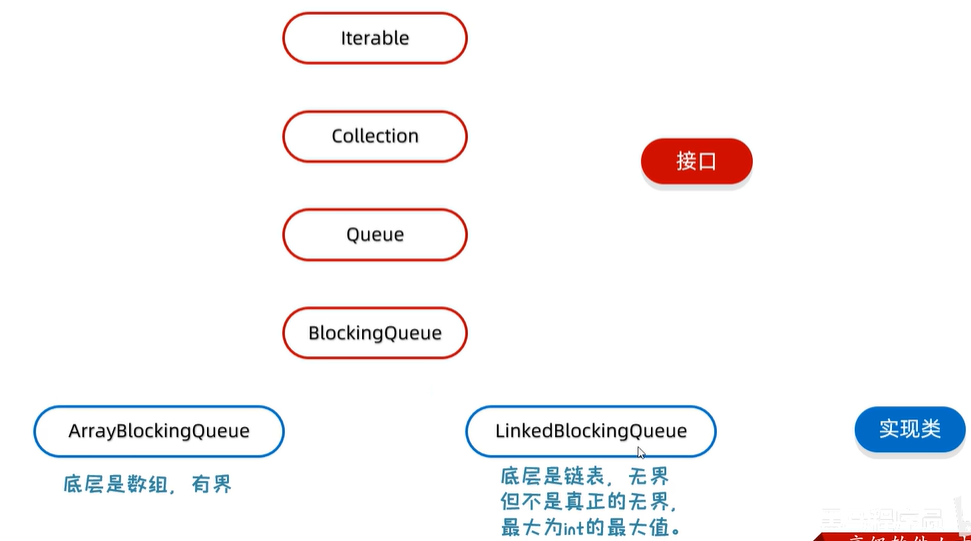

```java
public class Cook extends Thread {
    
    ArrayBlockingQueue<String> queue;
    
    public Cook(ArrayBlockingQueue<String> queue) {
        this.queue = queue;
    }
    
    @Override
    public void run() {
        while (true) {
            // 这里不用写同步代码块, 因为put的底层源码已经写了, take同理
            try {
                queue.put("面条");
            } catch (InterruptedException e) {
                throw new RuntimeException(e);
            }
        }
    }
}

public class Foodie extends Thread {
    
    ArrayBlockingQueue<String> queue;
    
    public Foodie(ArrayBlockingQueue<String> queue) {
        this.queue = queue;
    }
    
    @Override
    public void run() {
        while (true) {
            try {
                String food = queue.take();
            } catch (InterruptedException e) {
                throw new RuntimeException(e);
            }
        }
    }
}

public class Main {
    public static void main(String[] args) {
        ArrayBlockingQueue queue = new ArrayBlockingQueue();
        
        Cook cook = new Cook(queue);
        Foodie foodie = new Foodie(queue);
        
        cook.setName("厨师");
        foodie.setName("食客");

        cook.start();
        foodie.start();
    }
}
```

## 线程的六种状态

   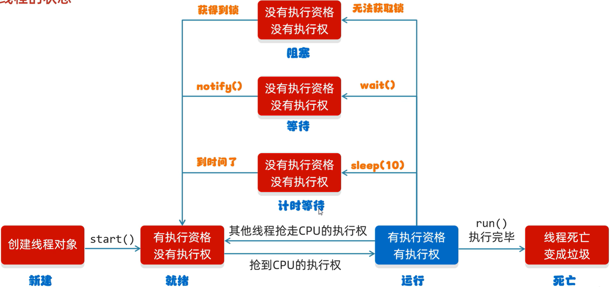

## 线程池

### 核心原理

+ 创建一个池子, 池子中是空的
+ 提供任务时, 池子会创建新的线程对象, 任务执行完毕, 线程归还给池子; 下次再提交任务时, 不需要创建新的线程, 直接复用已有的线程即可
+ 如果提交任务时, 池子中没有空闲线程, 也无法创建新的线程, 任务就会排队等待

### 代码实现

> Executors: 线程池的工具类, 通过调用方法返回不同类型的线程池对象

+ 创建线程池

  | 方法名称                                                     | 说明                     |
  | ------------------------------------------------------------ | ------------------------ |
  | public static ExecutorService newCachedThreadPool()          | 创建一个没有上限的线程池 |
  | public static ExecutorService newFixedThreadPool(int nThreads) | 创建有上限的线程池       |

+ 提交任务

+ 所有的任务全部执行完毕, 关闭线程池

```java
// 1.获取线程池对象
ExecutorService pool = Executor.newFixedThreadPool(3);
// 2.提交任务
pool.sumit(new MyRunnable());
pool.sumit(new MyRunnable());
pool.sumit(new MyRunnable());
pool.sumit(new MyRunnable());
pool.sumit(new MyRunnable());
......
// 3.销毁线程池(通常不需要)
// pool.shutdown();
```

### 自定义线程池

+ **拒绝策略**

  | 任务拒绝策略                           | 说明                                                       |
  | -------------------------------------- | ---------------------------------------------------------- |
  | ThreadPoolExecutor.AbortPolicy         | **默认策略:** 丢弃任务并抛出RejectedExecutionException异常 |
  | ThreadPoolExecutor.DiscardPolicy       | 丢弃任务, 但是不抛出异常, 不推荐的做法                     |
  | ThreadPoolExecutor.DiscardOldestPolicy | 抛弃队列中等待最久的任务, 然后把当前任务加入队列中         |
  | ThreadPoolExecutor.CallerRunsPolicy    | 调用任务的run()方法绕过线程池直接执行                      |

```java
// 参数一: 核心线程数量			   不能小于0
// 参数二: 最大线程数			    不能小于等于0, 最大数量>=核心线程数量
// 参数三: 空闲线程最大存活时间	   	不能小于0
// 参数四: 时间单位 			   	用TimeUnit指定
// 参数五: 任务队列, 即阻塞队列		 不能为null
// 参数六: 创建线程工厂			   不能为null
// 参数七: 任务的拒绝策略			  不能为null
// ThreadPoolExecutor threadPoolExecutor = new ThreadPoolExecutor(核心线程数量, 最大线程数量, 空闲线程最大存活时间, 时间单位, 任务队列, 创建线程工厂, 任务的拒绝策略);

ThreadPoolExecutor threadPoolExecutor = new ThreadPoolExecutor(
    3,
    6,
    60, 
    TimeUnit.SECONDS, 
    new ArrayBlockingQueue<>(3), 
    Executors.defaultThreadFactory(), 
	new ThreadPoolExecutor.AbortPolicy()
);
```


# 网络编程

## 三要素

+ **IP**
  + 127.0.0.1 (永远表示本机)
+ **端口号**
  + 取值范围为0~65535, 其中0~1023之间的端口号已用于一些知名的网络服务或应用
+ **协议**
  + **UDP:** **面向无连接**, 速度快, 大小限制一次最多发送64K, 数据不安全, 易丢失
  + **TCP:** **面向连接**, 速度慢, 没有大小限制, 数据安全

## InetAddress类

+ static InetAddress getByName(String host) : 确定主机名称的IP地址. 主机名称可以是机器名称, 也可以是IP地址获取此IP地址的主机名
+ String getHostName() : 获取此IP地址的主机名
+ String getHostAddress() : 返回文本显示中的IP地址字符串

## UDP通信

```java
/* 发送端 */

// 1.创建DatagramSocket对象
// 空参: 所有可用的端口中随机一个进行使用
// 有参: 指定端口号进行绑定
DatagramSocket socket = new DatagramSocket();

// 2.打包数据
String str = "hello";
byte[] bytes = str.getBytes(); // 发送的数据
InetAddress address = InetAddress.getByName("127.0.0.1"); // 发送到的ip地址
int port = 10086; // 发送到的端口号
DatagramPacket dp = new DatagramPacket(bytes, bytes.length, address, port);

// 3.发送数据
socket.send(dp);

// 4. 释放资源
socket.close();
```

```java
/* 接收端 */

// 1.创建DatagramSocket对象
// 接收的时候一定要绑定端口, 且该端口号与接收的端口号一致
DatagramSocket socket = new DatagramSocket(10086);

// 2.接收数据包
byte[] bytes = new byte[1024]; // 接收的容器, 容量要大于等于所要接收的数据长度
DatagramPacket dp = new DatagramPacket(bytes, bytes.length);
socket.receive(dp); // 该方法是阻塞的, 当程序运行到这时会死等, 直到接收到数据才能继续往下运行

// 3.解析数据包
byte[] data = dp.getData(); // 获取数据
int len = dp.getLength(); // 获取数据长度
InetAddress address = dp.getAddress(); // 获取发送端的ip
int port = dp.getPort(); // 获取发送端发送的端口号

// 4.释放资源
socket.close();
```

+ **三种通信方式**

  + **单播:** 上述代码为单播

  + **组播:** 224.0.0.0 ~ 239.255.255.255, 其中224.0.0.0 ~ 224.0.0.255为预留的组播地址

    ```java
    /* 发送端 */
    // 第一步为创建MulticastSocket对象
    MulticastSocket ms = new MulticastSocket();
    
    
    /* 接收端 */
    // 第一步为创建MulticastSocket对象
    MulticastSocket ms = new MulticastSocket();
    
    // 在接收数据包前要将本机添加到发送端发送的组播地址中
    InetAddress address = InetAddress.getByName("224.0.0.1");
    ms.joinGroup(address);
    ```

  + **广播:** 255.255.255.255

## TCP通信

+ 通信之前要保证连接已经建立
+ 通过socket产生IO流来进行网络通信

     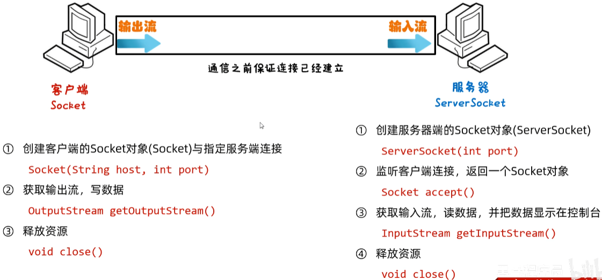

```java
/* 客户端 */
// 1.创建Socket对象
// 在创建对象的同时会连接服务端, 如果连接不上, 代码会报错
Socket socket = new Socket("127.0.0.1", 10000);

// 2.从连接通道中获取输出流
OutputStream os = socket.getOutputStream();
os.write("hello".getBytes()); // 写出数据

// 3.释放资源
os.close();
socket.close();
```

```java
/* 服务端 */
// 1.创建ServerSocket对象
ServerSocket ss = new ServerSocket(10000);

// 2.监听客户端连接
Socket socket = ss.accept();

// 3.从连接通道中获取输入流读取数据
InputStream is = socket.getInputStream(); // 字节流, 不能接收中文
InputStreamReader isr = new InputStreamReader(is); // 转换为字符流
BufferedReader br = new BufferedReader(isr); // 转换为缓冲流, 提高效率
// BufferedReader br = new BufferedReader(new InputStreamReader(socket.getInputStream()));
int b;
while((b = br.read()) != -1) {
    sout((char) b);
}

// 4.释放资源
socket.close();
ss.close();
```


# 反射

> 反射允许对成员变量, 成员方法和构造方法的信息进行编程访问

 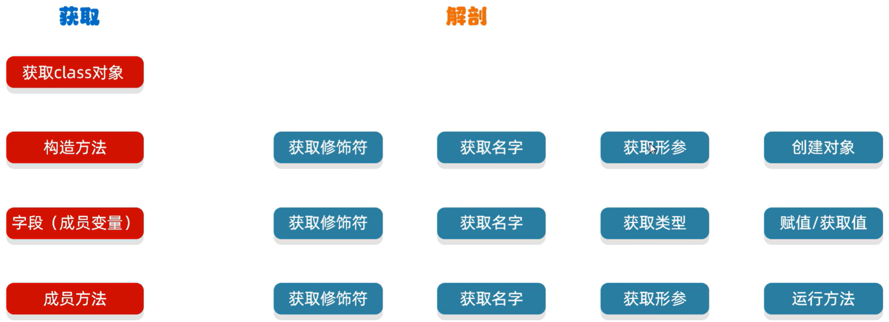

+ **作用**
  + 获取一个类里面所有的信息, 获取到了之后, 再执行其他的业务逻辑
  + 结合配置文件, 动态地创建对象并调用

## 获取class对象

​     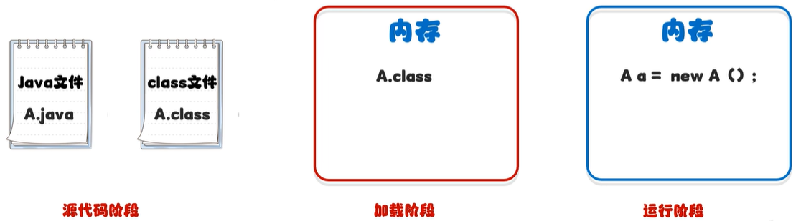

+ **三种方式**
  + **源代码阶段:** Class.forName("全类名");
  + **加载阶段:** 类名.class
  + **运行阶段:** 对象.getClass();

## 获取构造方法

​     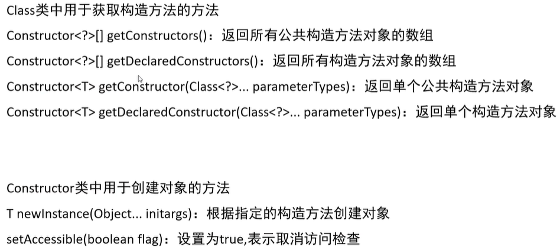

## 获取成员变量

​     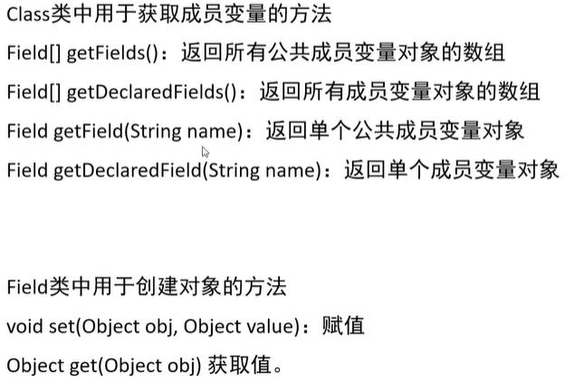

## 获取成员方法

​      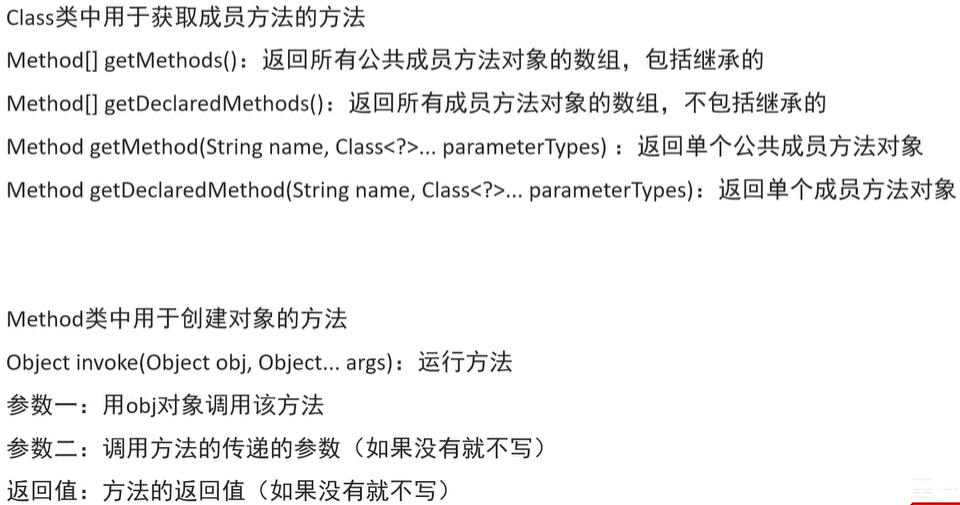 


# 动态代理

+ **特点:** 无侵入式的给代码增加额外的功能

     

+ **为什么需要代理:** 对象需要做的事太多, 可以通过代理来转移部分职责

+ **代理长什么样:** 对象有什么方法想被代理, 代理就一定要有对应的方法

+ **Java通过什么来保证代理的样子:** 通过接口保证, 后面的对象和代理需要实现同一个接口, 接口中就是被代理的所有方法

+ **如何为Java对象创建一个代理对象**

  + java.lang.reflect.Proxy类: 提供了为对象产生代理对象的方法

      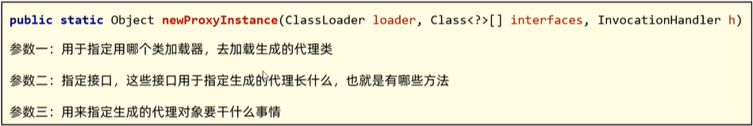


# 日志

## 作用

+ 跟输出语句一样，可以把程序在运行过程中的详细信息都打印在控制台上。

+ 利用log日志还可以把这些详细信息保存到文件和数据库中。

## 使用步骤

+ 不是java的，也不是自己写的，是第三方提供的代码，所以我们要导入jar包。

     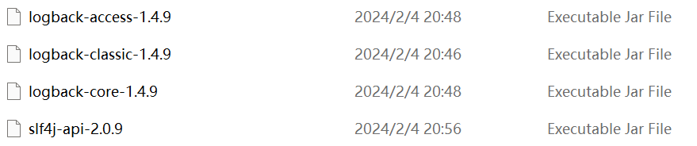

+ 把第三方的代码导入到当前的项目当中

+ 把配置文件粘贴到src文件夹下

+ 在代码中获取日志对象

+ 调用方法打印日志

## 日志级别

+ `TRACE, DEBUG, INFO, WARN, ERROR`

+ 还有两个特殊的：

  + ALL：输出所有日志

  + OFF：关闭所有日志

+ 日志级别从小到大的关系：
  + `TRACE < DEBUG < INFO < WARN < ERROR`

## 配置文件

```xml
<?xml version="1.0" encoding="UTF-8"?>
<configuration>
    <!--
        CONSOLE ：表示当前的日志信息是可以输出到控制台的。
    -->
    <appender name="CONSOLE" class="ch.qos.logback.core.ConsoleAppender">
        <!--输出流对象 默认 System.out 改为 System.err-->
        <target>System.out</target>
        <encoder>
            <!--格式化输出：%d表示日期，%thread表示线程名，%-5level：级别从左显示5个字符宽度
                %msg：日志消息，%n是换行符-->
            <pattern>%d{yyyy-MM-dd HH:mm:ss.SSS} [%-5level]  %c [%thread] : %msg%n</pattern>
        </encoder>
    </appender>

    <!-- File是输出的方向通向文件的 -->
    <appender name="FILE" class="ch.qos.logback.core.rolling.RollingFileAppender">
        <encoder>
            <pattern>%d{yyyy-MM-dd HH:mm:ss.SSS} [%thread] %-5level %logger{36} - %msg%n</pattern>
            <charset>utf-8</charset>
        </encoder>
        <!--日志输出路径-->
        <file>E:/myLogRecord/log.log</file>
        <!--指定日志文件拆分和压缩规则-->
        <rollingPolicy
                       class="ch.qos.logback.core.rolling.SizeAndTimeBasedRollingPolicy">
            <!--通过指定压缩文件名称，来确定分割文件方式-->
            <fileNamePattern>E:/myLogRecord/log-%d{yyyy-MMdd}.log%i.gz</fileNamePattern>
            <!--文件拆分大小-->
            <maxFileSize>1MB</maxFileSize>
        </rollingPolicy>
    </appender>

    <!--
    	level:用来设置打印级别，大小写无关：TRACE, DEBUG, INFO, WARN, ERROR, ALL 和 OFF， 默认debug
    	<root>可以包含零个或多个<appender-ref>元素，标识这个输出位置将会被本日志级别控制。
    -->
    <root level="ALL">
        <appender-ref ref="CONSOLE"/>
        <appender-ref ref="FILE" />
    </root>
</configuration>
```
