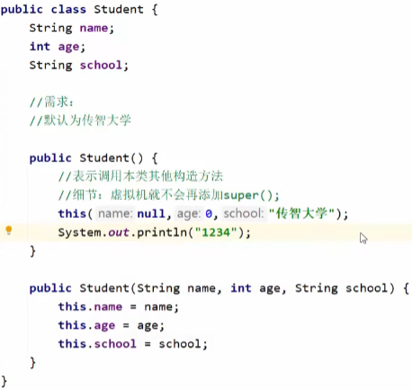

[TOC]

# JavaSE

## Java 基础

### JDK 和 JRE

+ **JDK 是什么？有哪些内容组成？**

  JDK 是 Java 开发工具包

  + **JVM 虚拟机:** Java 程序运行的地方

  + **核心类库:** Java 已经写好的东西，可以直接用

  + **开发工具:**  Javac、Java、jdb、jhat...

+ **JRE 是什么？有哪些内容组成？**

  + JRE 是 Java 运行环境
  + JVM、核心类库、运行工具

+ **JDK，JRE，JVM三者的包含关系**

  + JDK 包含 JRE

  + JRE 包含 JVM

### 运算符

#### 算术运算符

+ **隐式转换（自动类型提升）**

  + 把一个==取值范围小==的数值，转成==取值范围大==的数据

  + **取值范围:** double > float > long > int > short > byte

  + 取值范围小的，和取值范围大的进行运算，小的会先提升为大的，再进行运算

  + byte short char 三种类型的数据在运算时，都会直接先提升为 int ，然后再进行运算

    ```java
    byte a = 10;
    byte b = 20;
    数据类型? c = a + b; // a 和 b 为 byte, 在运算时提升为 int, 故此时数据类型为 int.
    ```

+ **强制转换**

  + 把一个==取值范围大==的数值，转成==取值范围小==的数据

  ```java
  目标数据类型 变量名 = (目标数据类型) 被强转的数据;
  ```

+ **字符串的 "+" 操作**

  + 当 "+" 操作中出现字符串时, 这个 "+" 是字符串连接符, 而不是算术运算符了, 会将前后的数据进行拼接, 并产生一个新的字符串

  + 连续进行 "+" 操作时, 从左到右逐个执行

    ``` java
    System.out.println(1 + 2 + "abc" + 2 + 1); // "3abc21"
    ```

#### 自增自减运算符

+ **参与计算:** 后缀(a++ 先用后加), 前缀(++a 先加后用)

#### 逻辑运算符

+ **普通逻辑运算符:** &, |, ^, !
+ **短路逻辑运算符:** &&, ||

#### 原码反码补码

+ **原码**
  + 十进制数据的二进制表现形式, 最左边是符号位, 0为正, 1为负
  + **弊端**: 利用原码进行计算时, 如果是正数没有问题, 但如果是负数计算, 结果会出错, 实际运算方向跟正确的运算方向==相反==
+ **反码**
  + 为了解决原码不能计算负数的问题而出现的
  + 正数的反码不变, 负数的反码在原码的基础上, 符号位不变, 数值取反, 0变1, 1变0
  + **弊端**: 负数运算时, 如果结果不跨0, 没有问题, 但如果结果跨0, 跟实际结果会有1的偏差
+ **补码**
  + 为了解决负数计算时跨0的问题而出现的
  + 正数补码不变, 负数的补码在反码的基础上 +1, 另外补码还能多记录一个特殊的值 -128, 该数据在1个字节下, 没有原码和反码
  + **计算机的存储和计算都是以补码的形式进行的**


> 该知识可以解释类型转换

#### 其他运算符

| 运算符  |      含义      |             运算规则             |
| :-----: | :------------: | :------------------------------: |
|  **&**  |   **逻辑与**   |      **0为false, 1为true**       |
| **\|**  |   **逻辑或**   |      **0为false, 1为true**       |
| **<<**  |    **左移**    |      **向左移动, 低位补0**       |
| **>>**  |    **右移**    | **向右移动, 高位补0或1(看符号)** |
| **>>>** | **无符号右移** |      **向右移动, 高位补1**       |

### 判断和循环

#### switch

+ **default**不一定写在最下面, 可写在任意位置, 但仍是最后执行
+ **case穿透:** 首先会拿小括号中表达式的值跟下面每一个case进行匹配, 如果匹配上了, 就会执行对应的语句体, 如果此时发现了break, 那么结束整个switch语句, 如果没发现break, 那么程序会继续执行下一个case的语句体, 一直遇到break或右大括号为止

> JDK12新特性:
>
> ```java
> switch (number) {
>     case 1 -> System.out.println("1");
>     	case 2 -> System.out.println("2");
>     	case 3 -> System.out.println("3");
>     	default -> System.out.println("无");
> }
> ```
>
> 默认case语句体内有break

+ **switch 和 if 的使用场景**
  + **if:** 一般用于对范围的判断
  + **switch:** 把有限个数据一一列举出来选择

#### for 与 while 的区别

+ for 循环中, 控制循环的变量, 因为归属 for 循环的语法结构中, 在 for 循环结束后, 就不能再次被访问到了
+ while 循环中, 控制循环的变量, 对于 while 循环来说不归属其语法结构中, 在 while 循环结束后, 该变量还可以继续使用

### 数组

#### 初始化

+ **在内存中为数组容器开辟空间, 并将数据存入容器中的过程**

+ **静态初始化**
  + 数据类型[] 数组名 = new 数据类型[] { 元素1, 元素2, 元素3...}
  + **简化后:** 数据类型[] 数组名 = { 元素1, 元素2, 元素3...}
  + **范例:** `int[] array = new int[] {11, 22, 33};`
  + **简化后:** `int[] array = {11, 22, 33};`
+ **动态初始化**
  + 数据类型[] 数组名 = new 数组类型[数组长度]
  + **范例:** `int[] array = new int[3];`
  + **数组默认初始化规律**
    + **整数类型:** 默认为 0
    + **小数类型:** 默认为 0.0
    + **字符类型:** 默认为 '/u0000' (空格)
    + **布尔类型:** 默认为 false
    + **引用数据类型:** 默认为 null

#### 地址值

+ 数组地址值表示数组在内存中的位置
+ 以 `[D@776ec8df` 为例
  + [ : 表示当前是一个数组
  + D: 表示当前数组里面的元素都是double类型的
  + @: 表示一个间隔符号 (固定格式)
  + 776ec8df: 数组真正的地址值 (十六进制)

#### 遍历数组

+ 在 IDEA 自动生成数组的遍历方式: `数组名.fori`

#### 内存图

+ **栈:** 方法运行时使用的内存, 比如 main 方法运行, 进入方法栈中执行
+ **堆:** 存储对象或者数组, new 来创建的, 都存储在堆内存中
+ **方法区:** 存储可以运行的 class 文件
+ **本地方法栈:** JVM 在使用操作系统功能的时候使用, 和我们开发无关
+ **寄存器:** 给 CPU 使用, 和我们开发无关


>从JDK8开始, 取消方法区, 新增元空间, 把原来方法区的多种功能进行拆分, 有的功能放到了栈中, 有的功能放到了元空间中


+ 当两个数组指向同一个小空间时, 其中一个数组对小空间中的值发生了改变, 那么其他数组再次访问的时候都是修改之后的结果了

> ==**拓展**:== 思考二维数组内存图 (静态初始化, 动态初始化, 动态初始化的两种特例)

### 方法

> 程序中最小的执行单元

#### 形参与实参

+ **形参:** 形式参数, 方法==定义==中的参数
+ **实参:** 实际参数, 方法==调用==中的参数 

#### 注意事项

+ 方法之间是平级关系, 不能相互嵌套定义

#### 重载

+ 在同一个类中, 定义了多个**同名的方法**, 这些同名的方法具有同种功能

+ 每个方法具有不同的**参数类型**或**参数个数**, 这些同名的方法构成重载关系

+ 同一个类中, 方法名相同, 参数不同的方法. 与返回值无关

  + **参数不同:** 个数不同, 类型不同, 顺序不同

  ```java
  // 不构成重载关系, 因为未满足参数不同这个要求
  public class MethodDemo {
      public static void fn(int a) {
          // 方法体
      }
      public static int fn(int a) {
          // 方法体
      }
  }
  ```

+ 虚拟机通过参数的不同来区分同名的方法

#### 方法的内存

+ **基本数据类型:** 整数类型, 浮点数类型, 布尔类型, 字符类型
  + 数据值是存储在自己的空间中
  + 赋值给其他变量, 也是赋值真实的值
+ **引用数据类型:** 需要 new 创造的
  + 数据值是存储在其他空间中, 自己空间中存储的是地址值
  + 赋值给其他变量, 赋值的是地址值

#### 方法的值传递

+ **传递基本数据类型的内存原理**

  + 传递基本数据类型时, 传递的是真实的数据, 形参的改变, 不影响实参的值

  + ```java
    public class ArgsDemo01 {
        public static void main(String[] args) {
            int number = 100;
            sout("调用change方法前: " + number);
            change(number);
            sout("调用change方法后: " + number);
        }
        public static void change(int number) {
           	number = 200;
        }
    }
    /*
    	输出结果为: 
    	调用change方法前: 100
    	调用change方法后: 100
    */
    ```

+ **传递引用数据类型的内存原理**

  + 传递引用数据类型时, 传递的是地址值, 形参的改变, 影响实参的值

> 以上内容依据内存图来理解

### 键盘录入

+ **第一套体系**

  + nextInt(): 接收整数

  + nextDouble(): 接收小数

  + next(): 接受字符串

    > 键盘录入的字符串是 new 创建的

  + 遇到空格、制表符、回车就停止接收，这些符号后面的数据就不会接受了

+ **第二套体系**

  + nextLine(): 接受字符串
  + 遇到空格、制表符可以接收，遇到回车才停止


## API

> Application Programming Interface 应用程序编程接口

### 字符串

#### String

+ 程序中所有字符串文字， 都为此类的对象

+ 字符串不可变， 它们的值在创建后不能被改变

+ **创建对象的方式**

  + `String name = "xxx"`

  + `String name = new String(String original)`

  + `String name = new String(char[] chs)`

    + **需求:** 修改字符串的内容 

      + 如: abc -- {'a', 'b', 'c'} -- {'Q', 'b', 'c'} -- Qbc

    + ```java
      char[] chs = {'a', 'b', 'c', 'd'};
      String s4 = new String(chs);
      sout(s4); // abcd
      ```

  + `String name = new String(byte[] chs)`

    + **应用场景:** 在网络当中传输的数据都是字节信息, 一般要将字节信息进行转换, 转成字符串, 此时就要用到这个构造

    + ```java
      byte[] bytes = {97, 98, 99, 100};
      String s5 = new String(bytes);
      sout(s5); // abcd
      ```

+ **内存模型**

  + 当使用双引号直接赋值时, 系统会检查该字符串在串池中是否存在,不存在则创建新的, 存在则复用 **(节约内存)**

    

  + 每次 new 都会创造一个新空间, 这种方式创建对象不会复用 **(占内存)**

    

+ **常用方法**

  + **字符串比较**
    + boolean equals()
    + boolean equalsIgnoreCase()

  + **字符串遍历**
    + char charAt(int index) : 根据索引返回字符
    + int length()

  + **字符串截取**
    + String substring(int beginIndex, int endIndex)
    + String substring(int beginIndex)

  + **字符串替换**
    + String replace(target, replacement)


#### StringBuilder

+ StringBuilder 可以看成是一个容器， 创建之后里面的==**内容是可变**==的

+ **作用:** 提高字符串的操作效率 **(拼接和反转字符串时常用StringBuilder)**
+ **构造方法**
  + `StringBuilder strb = new StringBulder()` 
  + `StringBuilder strb = new StringBulder(String str)`
+ **常用方法**
  + StringBuilder append(任意类型) : 添加数据, 并返回对象本身
  + StringBuilder reverse() : 反转容器中的内容
  + int length() : 返回长度
  + String toString() : 将StringBuilder转换成String

#### StringJoiner

+ 与 StringBuilder 一样可以看成是一个容器， 创建之后里面的==**内容是可变**==的
+ **作用:** 提高字符串的操作效率, 而且代码编写更加简洁, 但是目前市场上很少有人用(JDK8后出现的)
+ **构造方法**
  + `StringJoiner sj = new StringJoiner(间隔符号)` : 创建一个对象, 指定拼接时的间隔符号
  + `StringJoiner sj = new StringJoiner(间隔符号, 开始符号, 结束符号)` : 创建一个对象, 指定拼接时的间隔符号、开始符号、结束符号
+ **常用方法**
  + StringJoiner add(添加的内容)
  + int length()
  + String toString()

> java已经写好的类, java在底层对它们做了一些处理, 使得打印对象不是地址值而是属性值

#### 字符串原理

+ **字符串存储的内存原理**

  + 直接赋值会复用字符串常量池中的
  + new 出来不会复用, 而是开辟一个新空间

+ **`==`比较的到底是什么**

  + 基本数据类型比较数据值
  + 引用数据类型比较地址值

+ **字符串拼接的底层原理**

  + **无变量直接拼接:** 会复用串池中的字符串

    

  + **有变量拼接**

    + JDK8前: `String s2 = s1 + "b"` 相当于 `new StringBuilder().append(s1).append("b").toString()`

      

    + JDK8后: 预估空间, 创建数组

      

  + **结论:** 如果很多字符串变量拼接, 不要直接 + , 在底层会创建多个对象, 浪费时间, 浪费空间 ==**(建议使用StringBuilder)**==

+ **StringBuilder提高效率原理图**

  

+ **StringBuilder源码分析**

  + 默认创建一个长度为16的字节数组
  + 添加的内容长度小于16, 则直接存
  + 添加的内容长度大于16, 则扩容 (原来容量 * 2 + 2)
  + 如果扩容后还不够, 则以实际长度为准扩容

### ArrayList

+ **集合和数组的对比**

  + **数组**长度固定; **集合**长度可变 (自动扩容)

  + **数组**可以存基本数据类型和引用数据类型; **集合**可以存引用数据类型, 如果要存基本数据类型, 只能存包装类

    + | 基本数据类型 | 对应的包装类 |
      | :----------: | :----------: |
      |     byte     |     Byte     |
      |    short     |    Short     |
      |     char     |  Character   |
      |     int      |   Integer    |
      |     long     |     Long     |
      |    float     |    Float     |
      |    double    |    Double    |
      |   boolean    |   Boolean    |

+ **泛型(\<E\>):** 集合中存储数据的类型

+ **创建集合对象**

  + `ArrayList<数据类型> list = new ArrayList<>()`

+ ArrayList 时 Java 已经写好的一个类, 这个类**在底层做了一些处理**

  + 打印对象不是地址值, 而是集合中存储数据内容
  + 在展示的时候会拿 [ ] 吧所有的数据进行包裹

+ **成员方法**

  + **增**
    + boolean add(E e) : 返回值表示是否添加成功
  + **删**
    + boolean remove(E e) : 返回值表示是否删除成功
    + E remove(int index) : 删除指定索引的元素, **返回被删除的元素**
  + **改**
    + E set(int index, E e) : **返回原来的元素**
  + **查**
    + E get(int index)
    + int size()

### Math

+ **常用方法**
  + int abs(int a)
  + double ceil(double a) : 向上取整
  + double floor(double a) : 向下取整
  + int round(float a) : 四舍五入
  + int max(int a, int b)
  + double pow(double a, double b) : b可以是负数或小数
  + double sqrt(double a)
  + double cbrt(double a)
  + double random() : 返回值为double的随机值, 范围[0.0, 1.0)

### System

+ **常用方法**
  + void exit(int status) : 终止当前java虚拟机(0 : 正常停止；1 : 异常停止)
  + long currentTimeMillis() : 返回当前系统的时间毫秒值形式(时间原点 1970.1.1 8:0:0)
  + void arraycopy(数据源数组, 起始索引, 目的地数组, 起始索引, 拷贝个数) : 数组拷贝
+ **输出语句**
  + System.out.println()
  + **System :** 类名
  + **out :** 静态变量
  + **System.out :** 获取打印的对象
  + **println() :** 方法
  + **参数 :** 表示打印的内容
  + **核心逻辑**
    + 当我们打印一个对象的时候, 底层会调用对象的toString方法, 把对象变成字符串, 然后再打印再控制台上, 打印完毕换行处理


### Runtime

+ **常用方法**
  + Runtime getRuntime() : 获取当前系统的运行环境对象
  + void exit(int status) : 停止虚拟机
  + int availableProcessors() : 获得CPU的线程数
  + long maxMemory() : JVM能从系统中获取总内存大小(单位byte)
  + long totalMemory() : JVM已经从系统中获取总内存大小(单位byte)
  + long freeMemory() : JVM剩余内存大小(单位byte)
  + Process exec(String command) : 运行cmd命令

### Object

+ **顶级父类**, 只有空参构造

+ **常用方法**

  + String toString()

    + 默认情况下, 因为Object类中的toString方法返回的是地址值, 所以, 默认情况下, 打印一个对象打印的就是地址值, 但是地址值对于我们是没有意义的
    + **处理方案:** 重写父类Object中的toString方法

  + boolean equals(Object obj)

    + 同上, 默认的Object方法比较的是地址值, 需要重写

    + ```java
      String s = "abc";
      StringBuilder sb = new StringBuilder("abc");
      sout(s.equals(sb));  // false
      // equals方法是被s调用的, 而s是字符串
      // 所以equals要看String类中的
      // 字符串中的equals方法, 先判断参数是否为字符串
      // 如果是字符串, 再比较内部的属性
      // 但如果参数不是字符串的, 直接返回false
      
      sout(sb.equals(s));  // false
      // 由于StringBuildedr中没有重写equals方法
      // 使用的是Object中的, 即比较地址值
      ```

  + protected Object clone(int a)

    + 方法在底层会帮我们创建一个对象, 并把原对象中的数据拷贝过去
    + **书写细节**
      + 重写Object中的clone方法
      + 让JavaBean类实现Cloneable接口
      + 创建原对象并调用clone
    + **浅克隆** (Object默认浅克隆)
      + 不管对象内部的属性是基本数据类型还是引用数据类型, 都完全拷贝过来
    + **深克隆** (自己重写或使用第三方工具)
      + 基本数据类型拷贝过来, 常量池中的字符串复用, 引用数据类型会重新创建新的

### Objects

+ **工具类**
+ **常用方法**
  + boolean equals(Object a, Object b) : 先做非空判断, 再比较两个对象
    + 方法底层先判断a是否为null, 如果是null, 直接返回false, 如果不是, 那么就利用a再次调用equals方法
  + boolean isNull(Object obj)
  + boolean nonNull(Object obj)

### BigInteger

+ 在底层占用字节个数: byte1个字节, short2个字节, int4个字节, float4个字节, double8个字节, long8个字节

+ **构造方法**

  + BigInteger(int num, Random rnd) : 获取随机大整数, 范围: [0, 2^num^ - 1]
  + BigInteger(String val) : 获取指定的大整数
  + BigInteger(String val, int radix) : 获取指定进制的大整数

  + public static BigInteger valueOf(long val) : 静态方法获取BigInteger的对象, 内部有优化

+ **总结**

  + 如果BigInteger表示的数字没有超出long的范围, 可以用静态方法获取

  + 如果BigInteger表示的超出long的范围, 可以用构造方法获取

  + 对象一旦创建, BigInteger内部记录的值不能发生改变

    + ```java
      BigInteger bd1 = BigInteger.valueOf(10);
      BigInteger bd2 = BigInteger.valueOf(5);
      BigInteger bd3 = BigInteger.valueOf(10);
      
      sout(bd1 == bd2);  // false
      sout(bd1 == bd3);  // true
      ```

  + 只要进行计算都会产生一个新的BigInteger对象

+ **常见方法**

  + BigInteger add(BigInteger val) : 加法
  + BigInteger subtract(BigInteger val) : 减法
  + BigInteger multiply(BigInteger val) : 乘法
  + BigInteger divide(BigInteger val) : 除法, 获取商
  + BigInteger[] divideAndRemainder(BigInteger val) : 除法, 获取商和余数
  + boolean equals(Object x)
  + BigInteger pow(int exponent)
  + BigInteger max/min(BigInteger val)
  + int intValue(BigInteger val) : 转为int类型正数, 超出范围数据有误

### BigDecimal

+ 用于小数的精确运算
+ **构造方法**
  + BigDecimal(double val) : 有可能不准确, 不建议使用
  + BigDecimal(String val) : 更加精确
  + public static BigDecimal valueOf(double val)
+ **细节**
  + 如果表示的数字不大, 没有超出double的取值范围, 建议使用静态方法
  + 如果要表示的数字比较大, 超出了double的取值范围, 建议使用构造方法
  + 如果我们传递的是0~10之间的**整数**(如果是小数还是会重新new), 包含0和10, 那么方法会返回已经创建好的对象, 不会重新new
+ **常用方法**
  + BigDecimal add(BigDecimal val)
  + BigDecimal substract(BigDecimal val)
  + BigDecimal multiply(BigDecimal val)
  + BigDecimal divide(BigDecimal val) : 整除
  + BigDecimal divide(BigDecimal val, 精确几位, 舍入模式)
    + **舍入模式**(RoundingMode)
      + UP : 远离零方向舍入
      + DOWN : 向零方向舍入
      + CEILING : 向正无限大方向舍入
      + FLOOR : 向负无限大方向舍入
      + HALF_UP : 四舍五入(0.5向上舍)
      + HALF_DOWN : 四舍五入(0.5向下舍)

### 正则表达式

+ **作用**
  + 校验字符串是否满足规则
  + 在一段文本中查找满足要求的内容

+ **用法**

  

+ **[] :** 只匹配其中的一个

+ **(?i)xxx :** 忽略xxx的大小写

+ **贪婪爬取**

  + ab+ 或 ab*
    + 贪婪(尽可能多): abbbbbbbbbbb...

  + java默认的是贪婪爬取

+ **非贪婪**

  + ab+? 或 ab*?
    + 非贪婪(尽可能少): ab

+ **正则表达式在字符串中的作用**

  + boolean matches(String regex) : 判断字符串是否满足正则表达式的规则
  + String replaceAll(String regex, String newStr) : 按照正则表达式的规则进行替换
  + String[] split(String regex) : 按照正则表达式的规则切割字符串

+ **捕获分组**

  + 每组有组号
    + 以左括号为基准, 最左边的是第一组, 其次是第二组, 以此类推

  + **\\\\组号** : 表示把第x组的内容拿出来再用一次
  + **以 (.)\\\\1* 为例**
    + **(.) :** 以任意单字符看作第一组
    + **\\\\1 :** 把第一组拿出来再次使用
    + **\* :** 作用于 **\\\\1**, 表示把第一组拿出来用0次或多次

  + 后续还要继续使用本组数据
    + 正则内部使用 : \\\\组号
    + 正则外部使用 : $组号
    + 例 : `String s = str.relpaceAll("(.)\\1*", "$1");`

+ **非捕获分组**

  + 仅仅是把数据括起来, 不占用组号
  + **xxx(?=yyy)** : ? 指代前面的数据xxx, = 表示xxx后面要跟随的数据, 获取时只获取xxx
  + **xxx(?:yyy)** : ? 指代前面的数据xxx, : 表示xxx后面要跟随的数据, 获取时获取所有
  + **xxx(?!yyy)** : ? 指代前面的数据xxx, ! 表示xxx后面要跟随的数据, 获取时只获取不包含yyy的xxx文本


#### 爬虫

+ **Pattern :** 表示正则表达式对象

+ **Matcher :** 文本匹配器, 按照正则表达式的规则去读取字符串, 从头开始读取

+ ```java
  // 获取正则表达式对象
  Pattern p = Pattern.compile(regex);
  // 获取文本匹配器对象
  // m在str中找符合p规则的小串
  Matcher m = p.matcher(str);
  // 寻找匹配器中满足规则的子串
  // 如果没有返回false, 如果有返回true, 在底层记录子串的 起始索引 和 结束索引+1
  while(m.find()) {
  	// 方法底层会根据find方法记录的索引进行字符串的截取
  	String s = m.group();
      sout(s);
  }
  ```

### JDK7以前的时间相关类

#### Date

+ Javabean类, 用来描述时间, 精确到毫秒
+ **构造方法**
  + Date date = new Date() : 创建当前时间对象
  + Date date = new Date(毫秒值) : 创建指定时间对象
+ **常用方法**
  + void setTime(long time) : 设置/修改毫秒值
  + long getTime() : 获取时间对象的毫秒值

#### SimpleDateFormat

+ **作用**

  + **格式化:** 把时间变成我们喜欢的格式

  + **解析:** 把字符串表示的时间变成Data对象

+ **构造方法**
  + SimpleDateFormat() : 使用默认格式
  + SimpleDateFormat(String pattern) : 使用指定格式
+ **常用方法**
  + final String format(Date date) : 格式化 (日期对象 -- 字符串)
  + Date parse(String source) : 解析 (字符串 -- 日期对象) 

#### Calendar

+ Calendar代表了系统当前时间的日历对象, 可以单独修改、获取时间中的年、月、日
+ **细节**
  + Calendar是一个抽象类, 不能直接创建对象
  + **月份范围:** 0~11
  + **星期范围:** 1~7 (但是1代表星期日)
  + **字段表示 (Calendar类中有常量表示)**
    + 0 -- 纪元	1 -- 年	2 -- 月	3 -- 一年中的第几周	4 -- 一个月中的第几周	5 -- 一个月中的第几天(日期) 
+ **获取Calendar日历类对象的方法**
  + public static Calendar getInstance() : 获取当前时间的日历对象
+ **常用方法**
  + final Date getTime() : 获取日期对象
  + final setTime(Date date) : 给日历设置日期对象
  + long getTimeInMillis() : 得到时间毫秒值
  + void setTimeInMillis(long millis) : 给日历设置时间毫秒值
  + int get(int field) : 取日历中的某个字段信息
  + void set(int field, int value) : 修改日历的某个字段信息
  + void add(int field, int amount) : 为某个字段增加/减少指定的值

### JDK8的时间相关类

+ 代码更简单, 数据更安全==**(对象不可变)**==

#### Date相关

##### ZoneId

+ **时区**	
  + 洲名/城市名	国家名/城市名
+ **常用方法**
  + static Set<String\> getAvailableZoneIds() : 获取Java中支持的所有时区
  + static ZoneId systemDefault() : 获取系统默认时区
  + static ZoneId of(String zoneId) : 获取一个指定时区

##### Instant

+ **时间戳**
+ **常用方法**
  + static Instant now() : 获取当前时间的Instant对象 (标准时间)
  + static Instant ofXxxx(long epochMilli) : 根据 (秒/毫秒/纳秒) 获取Instant对象
  + ZonedDateTime atZone(ZoneId zone) : 指定时区
  + boolean isXxx(Instant otherInstant) : 判断系列的方法
  + Instant minusXxx(long millisToSubtract) : 减少时间系列的方法
  + Instant plusXxx(long millisToSubstract) : 增加时间系列的方法

##### ZonedDateTime

+ **带时区的时间**
+ static ZonedDateTime now() : 获取当前时间的ZonedDateTime对象
+ static ZonedDateTime ofXxx(...) : 获取指定时间的ZonedDateTime对象
+ ZonedDateTime withXxx(时间) : 修改时间系列的方法
+ ZonedDateTime minusXxx(时间) : 减少时间系列的方法
+ ZonedDateTime plusXxx(时间) : 增加时间系列的方法

#### SimpleDateFormat相关

##### DateTimeFormatter

+ **常用方法**
  + static DateTimeFormatter ofPattern(格式) : 获取格式对象
  + String format(时间对象) : 按照指定方式格式化

#### Calendar相关

##### LocalDate

##### LocalTime

##### LocalDateTime

#### 工具类

##### Duration

##### Period

##### ChronoUnit


## 面向对象

### 类

+ public class 类名 {

  ​	成员变量(代表属性，一般是名词)

  ​	成员方法(代表行为，一般是动词)

  ​	构造器

  ​	代码块

  ​	内部类
  }

+ **例如**

  ```java
  public class test1.Phone {
      // 属性(成员变量)
      String brand;
      double price;
      
      // 行为(方法)
      public void call() {
          ...
      }
      public void playGame() {
          ...
      }
  }
  ```

### 类的对象

+ 类名 对象名 = new 类名();

+ **例如:** `Phone p = new Phone();`

### 成员变量

+ 修饰符 数据类型 变量名称 = 初始化值

  > 一般无需指定初始化值，存在默认值。

### 封装

> ==对象代表什么，就得封装对应的数据，并提供数据对应的行为==

+ **例如：**
      人画圆: 两个类--人、圆	画行为则属于圆类
      人关门: 两个类--人、门	关门行为则属于门类

+ 我们可以把一些零散的数据封装成一个对象, 以后传递参数的时候, 只要传递一个整体就可以了, 不需要管这些零散的数据

+ **例如:**

  + 可避免以后要新增检查的信息

    + ```java
      User userInfo = new User(username, password, null, null);
      checkUserInfo(userInfo)
      ```

  + 无法避免

    + ```java
      checkUserInfo(username, password);
      ```

### 构造方法

+ public class 类名() {
          修饰符 类名(参数) {
              方法体;
          }
      }

+ **作用:** 给成员变量初始化

+ **特点**
  
     1. 方法名与类名相同，大小写也要一致
     1. 没有返回值类型，连void都没有
     1. 没有具体的返回值 (不能由return带回结果数据)
     
+ **执行实际**
          1. 创建对象的时候由虚拟机调用，不能手动调用构造方法
          2. 每创建一次对象，就会调用一次构造方法

+ **注意事项**

  + **构造方法的定义:** 
    
    1. 如果没有定义构造方法，系统将给出一个默认的无参数构造方法
	  2. 如果定义了构造方法，系统将不再提供默认的构造方法
    
	+ **构造方法的重载:**
  
	  ​	带参构造方法和无参构造方法，两者方法名相同，但是参数不同，这叫做构造方法的重载
  
  + **推荐的使用方式:**
  
	  ​	无论是否使用，都手动书写无参和带全部参数的构造方法
	
	  + **例如：**
	
	  ```java
	  public class Student {
    	private String name;
     		private int age;
      	public Student() {
    			...(空参构造)
    		}
	  		public Student(String name, int age) {
	  		    ...(带参构造)
	  		}
	  }
### 标准的JavaBean类

+ 类名需要见名知意
+ 成员变量使用**private**修饰
+ 提供至少两个构造方法
+ 成员方法
  + 提供每一个成员变量对应的setXXX()/getXXX() ==Alt + Insert 或 右键PTG_to_JavaBean 自动补全==
  + 如果还有其他行为，也需要写上

### 对象内存图

+ **Java内存分配**

  + **栈：**方法运行时所进的内存，变量也是在这里
  + **堆：**new出来的东西会在这块内存中开辟空间并产生地址
  + **方法区：**字节码文件(包含类中所有的成员变量和成员方法的信息)加载时进入的内存

  + **本地方法栈**

  + **寄存器**    

+ **一个对象的内存图：**
         `Student s = new Student()`

     1. 加载class文件 (把Student类的字节码文件加载到内存中)
     2. 申明局部变量 (对s申明)
     3. 在堆内存中开辟一个空间 (new开辟空间)
           1. 默认初始化/显示初始化
           2. 构造方法初始化
     4. 将堆内存中的地址值赋值给左边的局部变量 (即s是一个地址)

+ **两个对象的内存图：**

  ​	`Student s = new Student()`

  ​	`Student s1 = new Student()`

  + 此时不需要再加载Student.class文件，其他步骤一样
  + **注意:** 一个方法执行完毕后要出栈(main也是方法)，方法出栈后指向堆的指针消失，堆中的地址没有变量指向，成为垃圾，也消失

### this

+ **this的作用：**区分局部变量和成员变量
+ **this的本质：**代表所在方法调用者的地址值
+ 在非静态方法的参数中, 隐藏了变量this, 该this是由虚拟机赋值的

### 成员和局部变量

|     区别     |                  成员变量                  |                    局部变量                    |
| :----------: | :----------------------------------------: | :--------------------------------------------: |
| 类中位置不同 |                类中, 方法外                |               方法内, 方法申明上               |
| 初始化值不同 |                有默认初始值                |      没有默认初始值, 使用之前需要完成赋值      |
| 内存位置不同 |                   堆内存                   |                     栈内存                     |
| 生命周期不同 | 随着对象的创建而存在, 随着对象的消失而消失 | 随着方法的调用而存在, 随着方法的运行结束而消失 |
|    作用域    |                整个类中有效                |                 当前方法中有效                 |

+ **例如**

  ``` java
  public class Student {
  	// 成员变量
      private String name;
      private int age;
  }
  public class Test {
      public static void main(String[] args) {
          // 局部变量
          int a = 10;
          new Student();
      }
  }
  ```

### static

+ static表示静态, 是Java中的一个修饰符, 可以修饰成员变量, 成员方法

+ **静态变量:** 被static修饰的成员变量

  + **特点:** 
    + 被该类所有对象**共享**
    + 不属于对象, 属于类
    + ==**随着类的加载而加载, 优先于对象出现**==
  + **调用方式:** 
    + 类名调用 (推荐)
    + 对象名调用
  + 

+ **静态方法:** 被static修饰的成员方法, 叫做静态方法

  + **特点:**

    + 多用在测试类和工具类中

      > + **工具类:** 帮助我们做一些事情的, 但是不描述任何事物的类
      >   + 类名见名知意
      >   + 私有化构造方法
      >   + 方法定义为静态
      >
      > ```java
      > public class ArrUtil {
      >     private ArrUtil() {}
      >     
      >     public static int getMax(...) {...}
      >     public static int getMin(...) {...}
      >     public static int getSum(...) {...}
      >     public static int getAvg(...) {...}
      > }
      > ```

    + Javabean类中很少会用

  + **调用方式:** 

    + 类名调用 (推荐)
    + 对象名调用

+ ==**注意事项:**==
  
  + 静态方法只能访问静态变量和静态方法
  + 非静态方法可以访问所有
  + 静态方法中没有this关键字

### 继承

+ `public class 子类 extends 父类 {}`
+ **好处**
  + 可以把多个子类中重复的代码抽取到父类中, 提高代码的复用性
  + 子类可以在父类的基础上, 增加其他的功能, 使子类更强大
+ **什么时候用继承?**
  + 当类与类之间存在相同的内容, 并满足子类是父类中的一种, 就可以考虑使用继承, 来优化代码

+ **特点**
  + Java只支持单继承, 不支持多继承, 但支持多层继承
  + 每一个类都直接或间接继承与Object类

+ **子类能继承父类中的哪些内容?**

  + |             | 构造方法 |   成员变量   |       成员方法       |
    | :---------: | :------: | :----------: | :------------------: |
    | **非私有**  |   不能   |      能      | 能加入虚方法表的, 能 |
    | **private** |   不能   | 能, 但不能用 |         不能         |

  + 只有父类中的虚方法才能被子类继承, 并不是一级一级向上访问
    + 

+ **成员变量的访问特点**
  + **就近原则:** 先在局部位置找, 本类成员位置找, 父类成员位置找, 逐级往上

+ **成员方法的访问特点**
  
  + **就近原则**
  + **方法重写**
    + 当父类的方法不能满足子类现在的需求时, 需要进行方法重写
    + 方法声明与父类一致
    + @Override重写注释
  + **方法重写的本质**
    + 
  + **注意事项**
    + 子类重写父类方法时, 访问权限子类必须大于等于父类 (空着不写 < protected < public)
    + 子类重写父类方法时, 返回值类型子类必须小于等于父类
    + **重写方法尽量与父类保持一致**
    + 只有被添加到虚方法表中的办法才能被重写
  
+ **构造方法的访问特点**
  + 父类中的构造方法不会被子类继承
  + 子类中所有的构造方法默认先访问父类中的无参构造, 再执行自己
  + 子类构造方法的第一行语句默认都是: **super(), 不写也存在, 且必须在第一行**
  + **如果想调用父类的有参构造, 必须手写super进行调用**
+ **this, super使用总结**
  + 
  + 在构造方法中调用本类的其他构造方法, **虚拟机不会再添加super()**, 因为调用的其他构造方法中也默认有super(), **且this()和super()一样只能在第一行**
  + 

### 多态

+ 同类型的对象, 表现出的不同形态

+ **表现形式:** `父类类型 对象名称 = 子类对象;`

+ **前提**

  + 有继承关系
  + 有父类引用指向子类对象
  + 有方法重写

+ **好处**

  + 使用父类型作为参数, 可以接受所有子类对象, 体现多态的扩展性与便利性

+ **调用成员的特点**

  + **变量调用:** 编译看左边, 运行也看左边
    + javac 编译代码的时候会看左边的父类中有没有这个变量, 如果有, 编译成功, 如果没有则编译失败
    + java 运行代码的时候, 实际获取的就是左边父类中成员变量的值
  + **方法调用:** 编译看左边, 运行看右边
    + javac 编译代码的时候会看左边的父类中有没有这个方法, 如果有, 编译成功, 如果没有则编译失败
    + java 运行代码的时候, 实际获取的就是子类中的方法
  + **内存图解**
    + 

+ **优势**

  + 在多态形式下, 右边对象可以实现解耦合, 便于扩展和维护
  + 定义方法的时候, 使用父类型作为参数, 可以接收所有子类对象, 体现多态的便利性和扩展性

+ **弊端**

  + 不能使用子类的特有功能

  + **解决方法:** 强制类型转换

     

### 包

+ 包就是文件夹, 用来管理各种不同功能的 Java 类, 方便后期代码维护
+ **命名规则:** 公司域名反写 + 包的作用, 需要全部英文小写, 见名知意 (例如: com.itheima.domain)
+ **使用其他类的规则:** 使用其他包的类时, 需要使用全类名 (包名.类名) 或导包 (import)
  + 使用同一个包中的类时, 不需要导包
  + 使用 java.lang 包中的类时, 不需要导包
  + 其他情况都需要导包
  + 如果同时使用两个包中的同名类, 需要使用全类名

### final

+ **修饰方法:** 表明方法是最终方法, 不能被重写
+ **修饰类:** 表明该类是最终类, 不能被继承
+ **修饰变量:** 叫做常量, 只能被赋值一次
+ **命名规则**
  + **单个单词:** 全部大写
  + **多个单词:** 全部大写, 单词之间用下划线隔开
+ **修饰基本数据类型:** 记录的值不能发生改变
+ **修饰引用数据类型:** 记录的地址值不能发生改变, 内部的属性值**还是可以改变**的

### 权限修饰符


### 代码块

+ **局部代码块 (用于节约内存, 现在已经淘汰了)**
+ **构造代码块 (渐渐被淘汰了)**
  + 写在成员位置的代码块
  + 可以把多个构造方法中重复的代码抽取出来
  + **执行时机:** 在创建对象时先执行构造代码块, 再执行构造方法
+ **静态代码块**
  + **格式:** static{}
  + **特点:** 需要通过static关键字修饰, **随着类的加载而加载**, 并且自动触发, ==**只执行一次**==
  + **使用场景:** 在类加载的时候, 做一些数据初始化的时候使用

### 抽象类

+ **抽象方法:** 将**共性的**行为 **(方法)** 抽取到父类之后, 由于每一个子类执行的内容不一样, 在父类中不能确定**具体的方法体**, 该方法就可以定义为抽象方法
  + **定义格式:** `public abstract 返回值类型 方法名(参数列表);`
+ **抽象类:** 如果一个**类中存在抽象方法**, 该类就**必须声明为抽象类**
  + **定义格式:** `public abstract class 类名{}`
  + 强制子类按某种格式重写方法
+ **注意事项**
  + 抽象类不能实例化
  + 抽象类中不一定有抽象方法, 有抽象方法的类一定是抽象类
  + 可以有构造方法
  + 抽象类的子类
    + 要么重写抽象类中**所有的**抽象方法
    + 要么是抽象类

### 接口


+ 接口是一种规则, 对**行为**的抽象, 想让哪个类拥有一个行为, 就让这个类实现对用的接口

+ 当一个方法的参数是接口时, 可以传递接口所有实现类的对象, 这种方法称为接口多态

+ **注意事项**

  + 接口用关键字 interface 来定义 `public interface 接口名{}`
  + 接口不能实例化, **但是用接口的实现类可以实例化，将实现类的对象在内存中的地址指向接口，这个接口就可以使用了** 
    + `接口 实例 = new 实现接口的类();`
  + 接口和类之间是实现关系, 通过 implements 关键字表示 `public class 类名 implements 接口名{}`
    + 可以单实现, 也可以多实现 `public class 类名 implements 接口名1, 接口名2{}`
    + 实现类还可以在继承一个类的同时实现多个接口 `public class 类名 extends 父类 implements 接口名1, 接口名2{}`
  + 接口的子类 (实现类)
    + 要么重写接口中所有的抽象方法
    + 要么是抽象类

+ **接口中成员的特点**

  + **成员变量**
    + 只能是常量
    + 默认修饰符: `public static final`
  + **构造方法:** **==没有==**
  + **成员方法**
    + 只能是抽象方法
    + 默认修饰符: `public abstract`

+ **接口和接口的关系**

  + 继承关系, 可以单继承, 也可以多继承

+ **JDK8以后接口中新增的方法**

  + 允许在接口中定义**默认方法**, 需要使用关键字 default 修饰

    + **作用:** 解决接口升级问题
    + 接口中**默认方法**的定义格式
      + **格式:** `public default 返回值类型 方法名(参数列表) {}`
      + **范例:** `public default void show() {}`
    + 接口中默认方法的**注意事项**
      + 默认方法不是抽象方法, 不强制重写, 但如果被重写, 重写时要去掉 default 关键字
      + public可以省略, default不能省略
      + 如果实现了多个接口, 多个接口中存在相同名字的默认方法, 子类就必须对该方法进行重写

  + 允许在接口中定义**静态方法**, 需要用关键字 static 修饰

    + 接口中**静态方法**的定义格式
      + **格式:** `public static 返回值类型 方法名(参数列表) {}`
      + **范例:** `public static void show() {}`

    + 接口中默认方法的**注意事项**
      + 静态方法只能通过接口名调用, 不能通过实现类名或者对象名调用
      + public可以省略, static不能省略

+ **JDK9接口中新增的方法**

  + 接口中**私有方法**的定义格式

    + 为**默认方法**服务
      + **格式:** `private 返回值类型 方法名(参数列表) {}`
      + **范例:** `private void show() {}`

    + 为**静态方法**服务

      + **格式:** `private static 返回值类型 方法名(参数列表) {}`

      + **范例:** `private static void show() {}`

+ **适配器设计模式**
  + 当一个接口中抽象方法过多, 但只要使用其中一部分的时候, 可以使用适配器设计模式
  + 书写步骤
    + 编写中间类 XXXAdapter, 实现对应的接口
    + 对接口中的抽象方法进行空实现
    + 让真正的实现类继承中间类, 并重写需要用的方法
    + 为了避免其他类创建适配器类的对象, 中间的适配器类用 abstract 进行修饰

### 内部类

+ 在一个类的里面再定义一个类

+ 内部类表示的事物是外部类的一部分, 单独存在没有意义
+ 内部类可以直接访问外部类的成员, 包括私有
+ 外部类要访问内部类的成员, 必须创建对象

+ **成员内部类**

  + 写在成员位置, 属于外部类的成员
  + 成员内部类可以被一些修饰符所修饰, 比如: private, 默认, protected, public, static等
  + 在成员内部类里面, JDK16开始可以定义静态变量
  + **获取成员内部类对象**
    + **方式一:** 在外部类编写方法, 对外提供内部类对象 (当内部类被private修饰时使用)
    + **方式二:** `外部类名.内部类名 对象名 = 外部类对象.内部类对象;`
      + **范例:** `Outer.Inner oi = new Outer().new Inner();`
  + 内存图

  

+ **静态内部类**

  + 静态内部类只能访问外部类中的静态变量和静态方法, 如果想要访问非静态的需要创建对象
  + 静态内部类也是成员内部类中的一种
  + **创建静态内部类对象的格式:** `外部类名.内部类名 对象名 = new 外部类名.内部类名();`

  + **调用静态内部类中的方法**
    + **调用非静态方法的格式:** 先创建对象, 用对象调用
    + **调用静态方法的格式:** `外部类名.内部类名.方法名()`

+ **局部内部类**
  + 将内部类定义在方法里面, 类似于方法里面的局部变量
  + 外界是无法直接使用局部内部类, 需要在方法内创建内部类对象并使用
  + 该类可以直接访问外部类的成员, 也可以访问方法内的局部变量

+ **匿名内部类**

  + 隐藏名字的内部类, 可以写在成员位置, 也可以写在局部位置

  + **格式:** `new 类名或接口名() { 重写方法; };`

    + ```java
      new Inter() {
          public void show() {
              // 方法体
          }
      };
      ```

    + 包含了继承或实现, 方法重写, 创建对象
    + 整体就是一个类的子类对象或者接口的实现类对象

  + **使用场景**

    + 当方法的参数是接口或类时, 以接口为例, 可以传递这个接口的实现类对象, 如果实现类只要使用一次, 就可以用匿名内部类简化代码


## GUI

+ 采用图形化的方式显示操作界面
