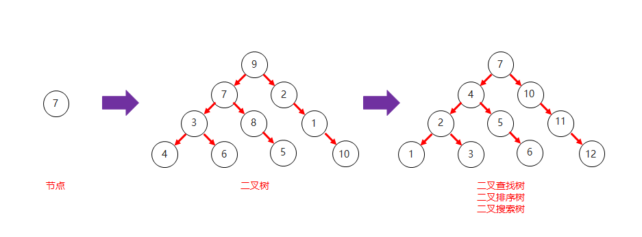
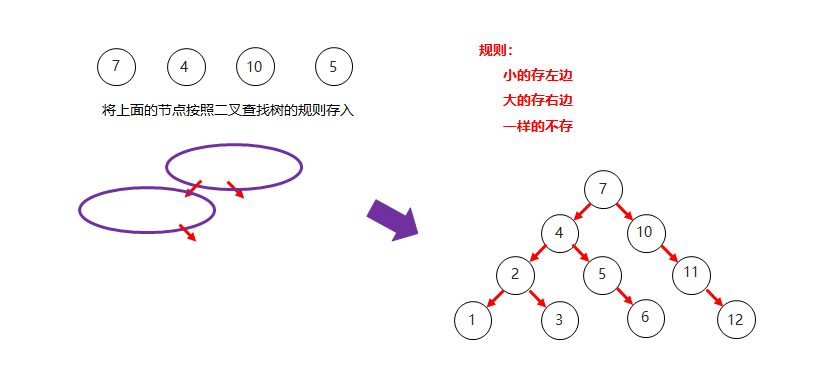
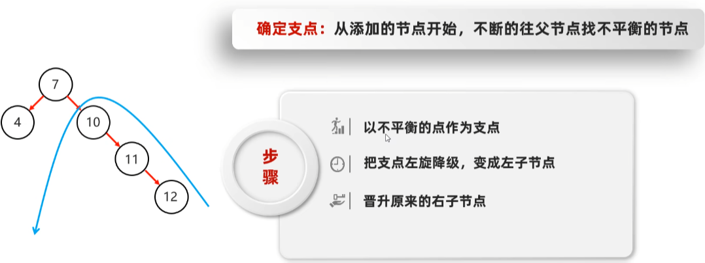
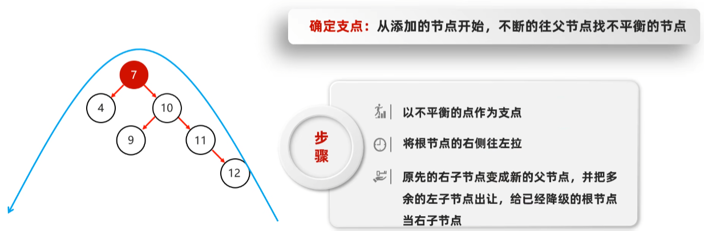
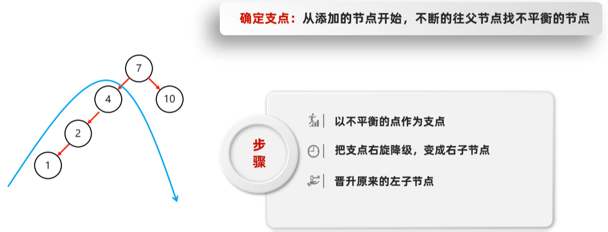
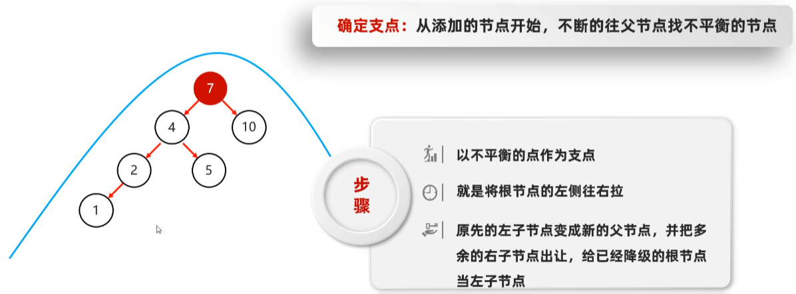
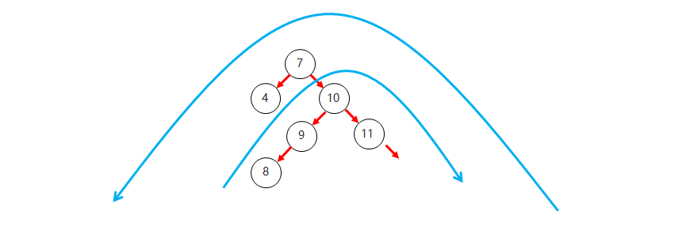
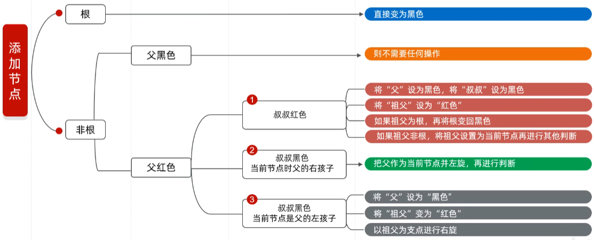

# 数据结构

## 栈和队列

- **栈结构**

  ​	先进后出

- **队列结构**

  ​	先进先出

## 数组和链表

- **数组结构**

  ​	查询快、增删慢

- **队列结构**

  ​	查询慢、增删快

## 二叉树

+ **二叉树的特点**

  + 二叉树中, 任意一个节点的度要小于等于2
    + **节点:**  在树结构中, 每一个元素称之为节点
    + **度:**  每一个节点的子节点数量称之为度

+ **二叉树结构图**

  

## 二叉查找树

+ **二叉查找树的特点**

  + 二叉查找树, 又称二叉排序树或者二叉搜索树
  + 每一个节点上最多有两个子节点
  + 左子树上所有节点的值都小于根节点的值
  + 右子树上所有节点的值都大于根节点的值

+ **二叉查找树结构图**

  

+ **二叉查找树和二叉树对比结构图**

  

+ **二叉查找树添加节点规则**

  + 小的存左边
  + 大的存右边
  + 一样的不存

  

## 平衡二叉树

+ **平衡二叉树的特点**

  + 二叉树左右两个子树的高度差不超过1
  + **任意**节点的左右两个子树都是一颗平衡二叉树

+ **平衡二叉树旋转**

  + **旋转触发时机**

    + 当添加一个节点之后,该树不再是一颗平衡二叉树

  + **左旋**

    + 就是将根节点的右侧往左拉, 原先的右子节点变成新的父节点, 并把多余的左子节点出让,给已经降级的根节点当右子节点

    

    

  + **右旋**

    + 就是将根节点的左侧往右拉, 左子节点变成了新的父节点, 并把多余的右子节点出让, 给已经降级根节点当左子节点

      

      

+ **平衡二叉树和二叉查找树对比结构图**

  

+ **平衡二叉树旋转的四种情况**

  + **左左**

    + 当根节点**左子树的左子树**有节点插入, 导致二叉树不平衡

    + 如何旋转: **直接对整体**进行右旋即可

      

  + **左右**

    + 当根节点**左子树的右子树**有节点插入, 导致二叉树不平衡

    + 如何旋转: **先**在**左子树**对应的节点位置进行左旋,**再对整体**进行右旋

      

  + **右右**

    + 当根节点**右子树的右子树**有节点插入, 导致二叉树不平衡

    + 如何旋转: **直接对整体**进行左旋即可

      

  + **右左**

    + 当根节点**右子树的左子树**有节点插入, 导致二叉树不平衡

    + 如何旋转: **先**在**右子树**对应的节点位置进行右旋,**再对整体**进行左旋

      

## 红黑树

- **红黑树的特点**

  - 平衡二叉B树
  - 每一个节点可以是红或者黑
  - 红黑树不是高度平衡的, 它的平衡是通过"自己的红黑规则"进行实现的

- **红黑树的红黑规则有哪些**

  + 每一个节点或是红色的, 或者是黑色的

  + 根节点必须是黑色

  + 如果一个节点没有子节点或者父节点, 则该节点相应的指针属性值为Nil, 这些Nil视为**叶节点**, 每个叶节点(Nil)是黑色的

  + 如果某一个节点是红色, 那么它的子节点必须是黑色(不能出现两个红色节点相连的情况)

  + 对每一个节点, 从该节点到其所有**后代叶节点**的简单路径上, 均包含相同数目的黑色节点

  

- **红黑树添加节点的默认颜色**

  - 添加节点时, 默认为红色, 效率高

    

- **红黑树添加节点后如何保持红黑规则**

  
  
  - **根节点位置**
  
    - 直接变为黑色
  - **非根节点位置**
  
    - **父节点为黑色**
      - 不需要任何操作, 默认红色即可
    - **父节点为红色**
      - **叔叔节点为红色**
        + 将"父节点"设为黑色, 将"叔叔节点"设为黑色
        
        + 将"祖父节点"设为红色
        
        + 如果"祖父节点"为根节点, 则将根节点再次变成黑色
      - **叔叔节点为黑色**
        
        + 将"父节点"设为黑色
        
        + 将"祖父节点"设为红色
        
        + 以"祖父节点"为支点进行旋转